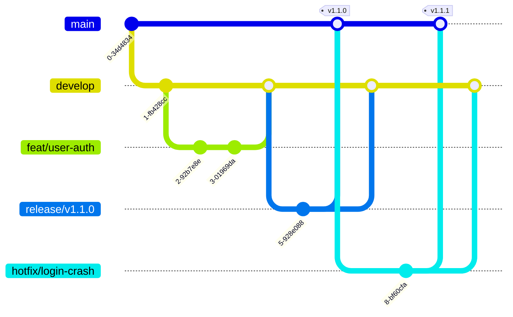

# Branching Stratejisi ve İş Akışı

Bu doküman, Tidyorg mühendislik ekiplerinin izleyeceği dal (branch) stratejisini
ve günlük çalışma pratiklerini tanımlar.

Son güncelleme: 2026-08-17

> **Önce bunu oku — iki ayrı akış var.** Repo'nun tipi hangi akışı izleyeceğini belirler:
>
> | Repo tipi | Örnek | Akış | Varsayılan dal |
> | :--- | :--- | :--- | :--- |
> | **Ürün repoları** | `pilot-intern-api`, `pilot-intern-web` | `feat/` → `develop` → `main` | `develop` |
> | **Kontrol düzlemi repoları** | `tidyorg` | **trunk-based** — `feat/` → `main` | `main` |
>
> Bölüm 1–7 ürün repolarını anlatır. Kontrol düzlemi istisnası **Bölüm 8**'dedir.

---

## 1. Neden Modified GitFlow (ürün repolarında)

Tidyorg bünyesinde çoklu servis mimarisi ve farklı tecrübe seviyelerinde
geliştiriciler (Backend, Frontend, DevOps, stajyerler) eşzamanlı çalışıyor. Ürün
repolarında **Modified GitFlow** benimsendi.

* **İzolasyon:** Geliştirme ve canlı ortam kodları ayrı dallarda durur.
* **Release kontrolü:** `develop` üzerinde toplanan değişiklikler `main`'e topluca
  aktarılır; sürüm yönetimi öngörülebilir olur.
* **Ön koşul meselesi:** Trunk-based development'ın ön koşulu yüksek otomatik test
  kapsamı ve feature flag disiplinidir. Bugün repo'larda test altyapısı henüz yok
  (`ci/test` dil job'ları manifest yoksa `skipped` geçiyor). O olgunluk geldiğinde bu
  karar yeniden değerlendirilmelidir.

> **Yanlış anlaşılmasın:** Bu seçim çakışma (merge conflict) riskini azaltmak için
> yapılmadı. Çakışmayı büyüten şey `develop`'ın varlığı değil, **feature dalının uzun
> yaşamasıdır**. Küçük PR + sık merge + Bölüm 5'teki `strict` status check kuralı, bu
> stratejide de çakışmayı yapısal olarak sınırlar.

---

## 2. Dal Akış Diyagramı



---

## 3. Branch İsimlendirme Kuralları

Tüm dallar `develop` (veya acil durumlarda `main`) üzerinden türetilir. Format:
`<kategori>/<kısa-aciklama>`.

| Kategori (Prefix) | Kullanım Amacı | Kaynak (Base) | Hedef |
| :--- | :--- | :--- | :--- |
| `feat/` | Yeni bir özellik eklendiğinde. | `develop` | `develop` |
| `fix/` | Geliştirme ortamındaki (non-prod) bir hatanın çözümü. | `develop` | `develop` |
| `chore/` | Bakım işleri, konfigürasyon ve bağımlılık güncellemeleri. | `develop` | `develop` |
| `docs/` | Sadece dokümantasyon güncellemeleri (kod değişikliği yok). | `develop` | `develop` |
| `release/` | Sürüm hazırlığı, son QA testleri ve versiyon etiketleme. | `develop` | `main` |
| `hotfix/` | Canlı (prod) ortamdaki acil ve kritik hataların çözümü. | `main` | `main` & `develop` |

> **Önek `feat/` — `feature/` değil.** Commit türleriyle (`feat`, `fix`, `chore`, `docs`)
> aynı sözlüğü kullanıyoruz ki dal adı ile commit mesajı arasında zihinsel çeviri
> gerekmesin. Bkz. [`commit-convention.md`](commit-convention.md).

> **İpucu:** Issue takip sistemi (örn. Linear) kullanılıyorsa branch ismine issue ID'si
> eklenmelidir. Örnek: `feat/LIN-123-user-auth`

---

## 4. Günlük İş Akışı (Adım Adım)

**Adım 1: En güncel kod tabanını alın**
```bash
git checkout develop
git pull origin develop
```

**Adım 2: Kendi çalışma dalınızı oluşturun**
```bash
git checkout -b feat/login-system
```

**Adım 3: Değişikliklerinizi yapın ve anlamlı commit'ler atın**
(Lütfen [`commit-convention.md`](commit-convention.md) belgesini referans alın.)
```bash
git add .
git commit -m "feat(auth): add google oauth2 login method"
```

**Adım 4: Uzak sunucuya (origin) kodunuzu gönderin**
```bash
git push -u origin feat/login-system
```

**Adım 5: Pull Request (PR) açın**
GitHub arayüzünden `feat/login-system` → `develop` yönünde bir PR açın. PR şablonu
otomatik dolar; **"Why?"** alanını boş bırakmayın.

Adım adım genişletilmiş anlatım ve CI beklentileri:
[`workflow-guide.md`](workflow-guide.md) Bölüm 2.

---

## 5. Korumalı Dallarda Ne Zorlanıyor

Aşağıdaki kurallar dokümanda tarif edilen bir temenni değil; `terraform/config/organization.yml`
→ `defaults.protected_branches` altında tanımlı ve GitHub'a uygulanmış durumdadır.

| Kural | `main` | `develop` |
| :--- | :--- | :--- |
| Gerekli onay sayısı | 2 | 1 |
| Code owner (mentör) onayı zorunlu | ✅ | ❌ |
| Yeni commit onayları düşürür (`dismiss_stale_reviews`) | ✅ | ✅ |
| Zorunlu status check | `ci/test` | `ci/test` |
| Dalın base ile güncel olması zorunlu (`strict`) | ✅ | ✅ |
| Çözülmemiş yorumla merge | ❌ | ✅ serbest |
| Force push / dal silme | ❌ | ❌ |
| Doğrudan push atabilen roller | mentor · head-of-engineering | mentor · head-of-engineering |

İki noktanın altı çizilmeli:

* **`strict` = çakışmaya karşı asıl koruma.** Dalınız base'e göre geride kaldıysa merge
  düğmesi açılmaz; güncelleyip CI'ı yeniden koşturmanız gerekir. Çakışma böylece
  `main`'de değil PR'da ortaya çıkar.
* **`enforce_admins = false`.** Mentör ve head-of-engineering rolleri bu kuralların
  tamamından kalıcı olarak muaftır. Bilinçli bir tavizdir; gerekçesi ve üç sonucu
  [`rbac-and-permissions.md`](rbac-and-permissions.md) Bölüm 4'te.

Kuralların repo bazında nasıl gevşetileceği: [`config-guide.md`](config-guide.md).

---

## 6. Merge Stratejisi

* **Feature → Develop — `Squash and Merge`:**
  Feature dalındaki "WIP", "fix typo" gibi ara commit'ler `develop`'a geçerken **tek bir
  temiz commit** halinde sıkıştırılır. `develop` geçmişi okunabilir kalır.
* **Develop → Main — `Merge Commit`:**
  Sürüm birleştirmeleri, `main`'de tarihçeyi ve kaynağı açıkça göstermek için merge
  commit ile yapılır.
* **Hotfix → Main — `Merge Commit`:**
  İzlenebilirlik kaybolmasın diye hotfix'ler de merge commit kullanır.

> **Rebase merge kapalıdır.** Repo ayarlarında `allow_rebase_merge = false`
> ([`modules/repository/main.tf`](../terraform/modules/repository/main.tf)); GitHub
> arayüzünde bu seçenek hiç görünmez. Merge sonrası dal **otomatik silinir**
> (`delete_branch_on_merge = true`) — elle temizlik gerekmez.

---

## 7. Release ve Hotfix

### 7.1 Release hazırlığı

1. `develop` dalından `release/vX.Y.Z` adında yeni bir dal oluşturulur.
2. Bu dalda yeni özellik geliştirilmez. Sadece versiyon numarası güncellenir, varsa son
   ufak bugfix'ler girilir.
3. Hazırlık bitince dal **hem `main` hem `develop`** dalına merge edilir.
4. `main`'e merge sonrası sürüm etiketi atılır.

Tam süreç, sürüm numarasının commit'lerden nasıl hesaplandığı ve otomasyonun bugünkü
durumu: [`release-process.md`](release-process.md).

### 7.2 Hotfix: acil durum senaryosu

Canlı ortamda sistemi durduran kritik bir hata keşfedildiğinde standart döngü beklenmez.

**Adım 1: Doğrudan `main` dalından yeni bir branch açın**
```bash
git checkout main
git pull origin main
git checkout -b hotfix/payment-crash
```

**Adım 2: Hatayı giderin ve commit'leyin**
```bash
git add .
git commit -m "fix(payment): resolve null pointer exception in gateway"
git push -u origin hotfix/payment-crash
```

**Adım 3: İki yönlü merge (kritik)**
Hotfix dalı test edildikten sonra PR ile `main`'e merge edilir.
**DİKKAT:** Değişikliğin gelecekteki sürümlerde ezilmemesi (regression olmaması) için
`hotfix/payment-crash` dalı **kesinlikle `develop`'a da merge edilmelidir.**

---

## 8. İstisna — Kontrol Düzlemi Repoları Trunk-Based Çalışır

_Karar F / K6 · 2026-08-16 · [`ROADMAP.md`](../ROADMAP.md)_

Konfigürasyonu ve altyapı motorunu barındıran repo'larda (`tidyorg`
ve Faz 8 sonrası doğacak `tidyorg-org-config`) **`develop` dalı yoktur.** Varsayılan dal
`main`'dir ve akış `feat/` → `main` biçiminde çalışır.

**Neden:** `terraform apply` yalnızca `main`'e push'ta tetikleniyor. Bu repolarda
`develop`'a merge edilen bir config değişikliği "merge edildi ama canlıda karşılığı yok"
durumunda kalır. Bu bir gecikme değil, **yalan**: repo'da yazan şey ile GitHub'daki
gerçeklik ayrışır.

Bu teorik bir endişe değil — canlı gözlendi ve kayda geçti.

**`develop` ne zaman geri gelir:** Arkasında ayrı bir ortam olduğunda. Bir sandbox
organizasyonu + bir prod organizasyonu ayrımı kurulursa `develop`'ın uygulanacağı gerçek
bir hedef doğar. Bugün tek org var.

**Bu repolarda pratikte:**

| | Kural |
| :--- | :--- |
| Dal akışı | `feat/…` → PR → `main` |
| Release | `main` üzerinde tag (`v1.0.0`) — release dalı yok |
| Hotfix | Ayrı bir süreç değil; normal PR akışı zaten kısa |
| Korumalı dal | Yalnızca `main` |

### 8.1 Bir repo'yu trunk-based yapmak

İki satır gerekir — ikincisi atlanırsa doküman yalan söyler:

```yaml
# terraform/config/repositories/<repo-adı>.yml
default_branch: main

protected_branches:
  develop: null      # varsayılanlardan gelen develop kuralını düşür
```

`default_branch: main` tek başına yetmez. `defaults.protected_branches` içinde `develop`
tanımlı olduğu için, düşürülmezse **var olmayan bir dala işaret eden ölü bir koruma kuralı**
kalır — ve dal silindikten sonra bir sonraki `apply` onu sessizce **yeniden yaratır**.

`null` yazma imkânı bu iş için eklendi: `repositories.tf` dal anahtarlarını birleştirdiği
için, kaldırma kaçışı olmadan bir repo `defaults` içindeki bir dal kuralından asla
kurtulamıyordu. Ayrıntı: [`config-guide.md`](config-guide.md).

> ⚠️ **Silme sırası:** `develop` korumasında `allow_deletions: false` var. Dalı silmeye
> çalıştığında GitHub itiraz ederse sebebi budur — mentör/head-of-engineering rolü
> `enforce_admins = false` sayesinde yine de silebilir, ama temiz yol önce config'den
> kuralı düşürüp `apply` etmektir.

---

## 9. İlgili Dokümanlar

- [`workflow-guide.md`](workflow-guide.md) — Tüm iş akışlarının giriş noktası
- [`commit-convention.md`](commit-convention.md) — Commit mesajı standardı
- [`code-review-guide.md`](code-review-guide.md) — PR açma ve review kuralları
- [`release-process.md`](release-process.md) — Sürüm çıkarma
- [`config-guide.md`](config-guide.md) — Dal kurallarını değiştirmek
- [`../ROADMAP.md`](../ROADMAP.md) — Karar F (trunk-based istisnası)
