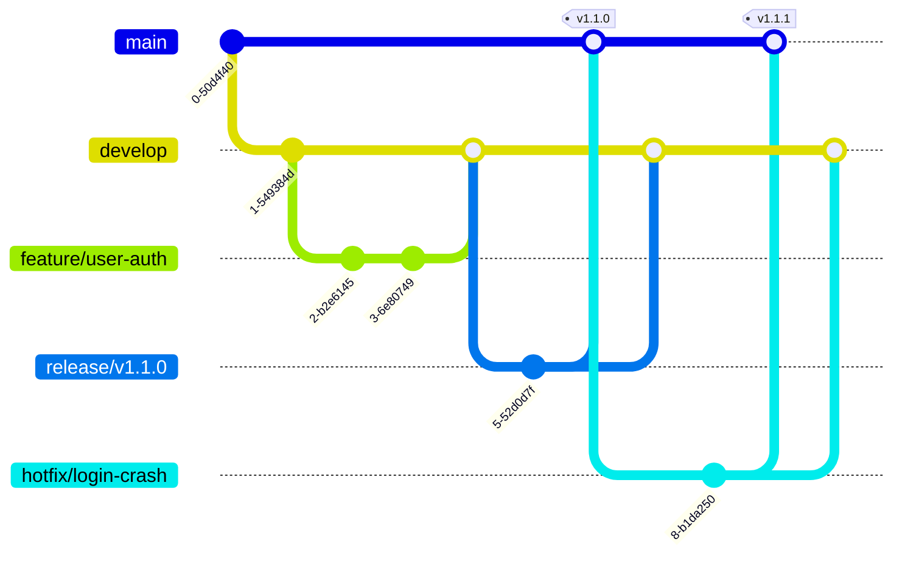

# Branching Stratejisi ve İş Akışı

Bu doküman, Tidyorg mühendislik ekiplerinin kaynak kodu yönetiminde izleyeceği standart dal (branch) stratejisini ve günlük çalışma pratiklerini tanımlar.

## 1. Neden Modified GitFlow?

Tidyorg bünyesinde çoklu mikroservis mimarisi ve farklı büyüklüklerdeki geliştirici ekipleri (Backend, Frontend, DevOps, Stajyerler) eşzamanlı olarak çalışmaktadır. Bu karmaşıklığı yönetmek için **Modified GitFlow** stratejisini benimsedik.

* **İzolasyon:** Geliştirme (development) ve canlı (production) ortam kodları tamamen izole edilmiştir.
* **Release Kontrolü:** `develop` dalı üzerinden test edilen kodlar topluca `main` dalına aktarılır, bu da sürüm yönetimini (versioning) çok daha öngörülebilir kılar.
* **Ölçeklenebilirlik:** Trunk-based development'ın aksine, tecrübe seviyesi farklı geliştiricilerin aynı projede güvenle çalışmasına olanak tanır.

---

## 2. Dal Akış Diyagramı

Genel iş akışımız aşağıdaki Mermaid diyagramında görselleştirilmiştir:



---

## 3. Branch İsimlendirme Kuralları

Tüm dallar `develop` (veya acil durumlarda `main`) üzerinden türetilir. İsimlendirmeler standart formatta olmalıdır: `<kategori>/<kısa-aciklama>`.

| Kategori (Prefix) | Kullanım Amacı | Kaynak (Base) | Hedef |
| :--- | :--- | :--- | :--- |
| `feature/` | Yeni bir özellik (feature) eklendiğinde. | `develop` | `develop` |
| `fix/` | Geliştirme ortamındaki (non-prod) bir hatanın çözümü. | `develop` | `develop` |
| `chore/` | Bakım işleri, konfigürasyon ve bağımlılık güncellemeleri. | `develop` | `develop` |
| `docs/` | Sadece dokümantasyon güncellemeleri (kod değişikliği yok). | `develop` | `develop` |
| `release/` | Sürüm hazırlığı, son QA testleri ve versiyon etiketleme. | `develop` | `main` |
| `hotfix/` | Canlı (prod) ortamdaki acil ve kritik hataların çözümü. | `main` | `main` & `develop` |

> **İpucu:** Issue takip sistemi (örn. Linear) kullanılıyorsa, branch ismine issue ID'si eklenmelidir. Örnek: `feat/LIN-123-user-auth`

---

## 4. Günlük İş Akışı (Adım Adım)

Bir geliştiricinin günlük standart iş akışı aşağıdaki adımlardan oluşur.

**Adım 1: En güncel kod tabanını alın**
```bash
git checkout develop
git pull origin develop
```

**Adım 2: Kendi çalışma dalınızı (feature branch) oluşturun**
```bash
git checkout -b feature/login-system
```

**Adım 3: Değişikliklerinizi yapın ve anlamlı commit'ler atın**
(Lütfen `commit-convention.md` belgesini referans alın).
```bash
git add .
git commit -m "feat(auth): add google oauth2 login method"
```

**Adım 4: Uzak sunucuya (origin) kodunuzu gönderin**
```bash
git push -u origin feature/login-system
```

**Adım 5: Pull Request (PR) Açın**
GitHub arayüzü üzerinden `feature/login-system` dalından `develop` dalına doğru bir PR açın. İlgili takım üyelerinden kod incelemesi (Code Review) talep edin.

---

## 5. Merge Stratejisi

Farklı hedeflere doğru yapılan birleştirmeler (merge) için farklı stratejiler uygularız:

* **Feature -> Develop (`Squash and Merge`):**
  Yeni özellik dallarındaki onlarca küçük "WIP (Work In Progress)", "fix typo" gibi kirli commit'ler, develop dalına geçerken **tek bir temiz commit** halinde sıkıştırılır (squash). Bu, `develop` geçmişini okunabilir kılar.
* **Develop -> Main (`Merge Commit`):**
  Sürüm (release) birleştirmeleri, `main` dalında tarihçeyi ve nereden geldiğini açıkça göstermek için birleştirme düğümleri (merge commit) ile yapılır.
* **Hotfix -> Main (`Merge Commit`):**
  Hotfix birleştirmeleri de izlenebilirliğin kaybolmaması için Merge Commit kullanılarak yapılır.

---

## 6. Release Hazırlık Süreci

`develop` dalındaki özellikler belirli bir doygunluğa ulaştığında `main` dalına aktarılmak üzere bir Release (Sürüm) süreci başlatılır.

1. `develop` dalından `release/vX.Y.Z` adında yeni bir dal oluşturulur.
2. Bu dalda yeni özellik (feature) geliştirilmez. Sadece versiyon numarası güncellenir (bump), CHANGELOG dosyası hazırlanır ve varsa son ufak test hataları (bugfix) giderilir.
3. Hazırlıklar tamamlandığında bu dal **hem `main` hem de `develop`** dalına merge edilir.
4. `main` dalına merge yapıldıktan hemen sonra GitHub üzerinden bir Release Tag (örn. `v1.2.0`) oluşturulur.

---

## 7. Hotfix: Acil Durum Senaryosu

Canlı ortamda (`main` dalında çalışan kodda) sistemi durduran kritik bir hata keşfedildiğinde, standart prosedür bypass edilerek doğrudan **Hotfix** süreci işletilir.

**Adım 1: Doğrudan `main` dalından yeni bir branch açın**
```bash
git checkout main
git pull origin main
git checkout -b hotfix/payment-crash
```

**Adım 2: Hatayı giderin ve commit'leyin**
```bash
git add .
git commit -m "fix(payment): resolve null pointer exception in gateway"
git push -u origin hotfix/payment-crash
```

**Adım 3: İki Yönlü Merge İşlemi (Çok Kritik!)**
Hotfix dalı test edildikten sonra açılacak PR ile `main` dalına merge edilir.
**DİKKAT:** Bu değişikliğin gelecekteki sürümlerde ezilmemesi (regression olmaması) için `hotfix/payment-crash` dalı **kesinlikle `develop` dalına da merge edilmelidir.**
```