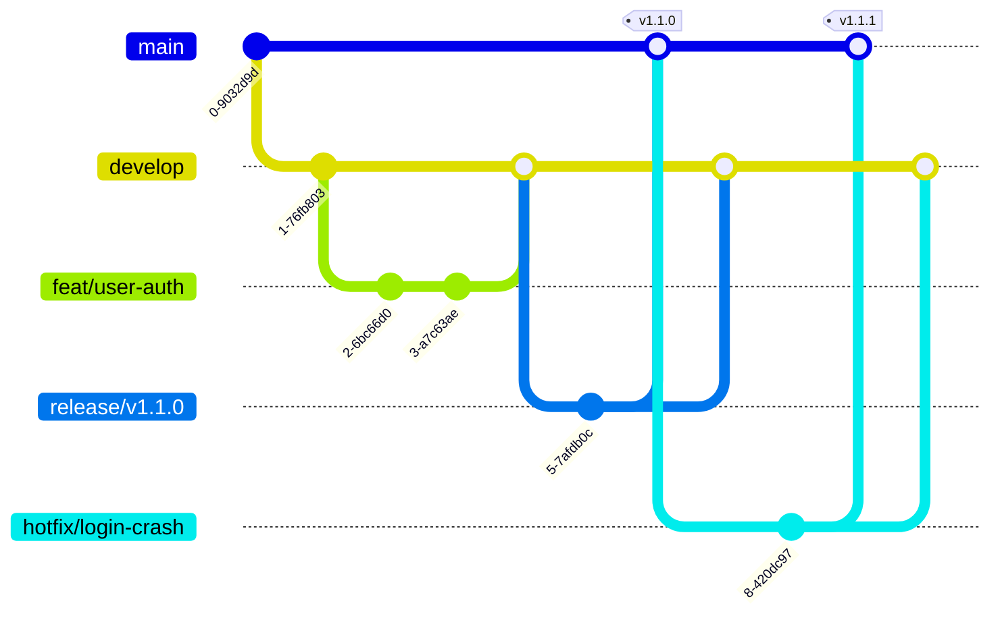

# Branching Strategy and Workflow

This document defines the branch strategy and daily working practices that Tidyorg
engineering teams will follow.

Last updated: 2026-08-17

> **Read this first — there are two separate flows.** A repo's type determines which flow it follows:
>
> | Repo type | Example | Flow | Default branch |
> | :--- | :--- | :--- | :--- |
> | **Product repos** | `pilot-intern-api`, `pilot-intern-web` | `feat/` → `develop` → `main` | `develop` |
> | **Control-plane repos** | `tidyorg` | **trunk-based** — `feat/` → `main` | `main` |
>
> Sections 1–7 describe product repos. The control-plane exception is in **Section 8**.

---

## 1. Why Modified GitFlow (in product repos)

Within Tidyorg, a multi-service architecture and developers of different experience levels
(Backend, Frontend, DevOps, interns) work concurrently. In product
repos, **Modified GitFlow** was adopted.

* **Isolation:** Development and production code live on separate branches.
* **Release control:** Changes gathered on `develop` are moved to `main` in a batch;
  version management becomes predictable.
* **A matter of preconditions:** The precondition for trunk-based development is high automated test
  coverage and feature flag discipline. Today the repos don't yet have a test infrastructure
  (language `ci/test` jobs pass as `skipped` when there is no manifest). When that maturity arrives, this
  decision should be re-evaluated.

> **Don't misread this:** This choice was not made to reduce merge conflict risk. What grows a
> conflict is not the existence of `develop` but **the feature branch living long**. Small PRs +
> frequent merges + the `strict` status check rule in Section 5 also structurally limit conflicts in this strategy.

---

## 2. Branch Flow Diagram



---

## 3. Branch Naming Rules

All branches are derived from `develop` (or from `main` in emergencies). Format:
`<category>/<short-description>`.

| Category (Prefix) | Purpose of use | Source (Base) | Target |
| :--- | :--- | :--- | :--- |
| `feat/` | When a new feature is added. | `develop` | `develop` |
| `fix/` | Fixing a bug in the development (non-prod) environment. | `develop` | `develop` |
| `chore/` | Maintenance work, configuration, and dependency updates. | `develop` | `develop` |
| `docs/` | Documentation-only updates (no code change). | `develop` | `develop` |
| `release/` | Release preparation, final QA tests, and version tagging. | `develop` | `main` |
| `hotfix/` | Fixing urgent and critical bugs in the live (prod) environment. | `main` | `main` & `develop` |

> **The prefix is `feat/` — not `feature/`.** We use the same vocabulary as the commit types
> (`feat`, `fix`, `chore`, `docs`) so that no mental translation is needed between the branch name
> and the commit message. See [`commit-convention.md`](commit-convention.md).

> **Tip:** If an issue tracking system (e.g. Linear) is used, the issue ID should be
> added to the branch name. Example: `feat/LIN-123-user-auth`

---

## 4. Daily Workflow (Step by Step)

**Step 1: Get the most up-to-date code base**
```bash
git checkout develop
git pull origin develop
```

**Step 2: Create your own working branch**
```bash
git checkout -b feat/login-system
```

**Step 3: Make your changes and write meaningful commits**
(Please refer to the [`commit-convention.md`](commit-convention.md) document.)
```bash
git add .
git commit -m "feat(auth): add google oauth2 login method"
```

**Step 4: Push your code to the remote (origin)**
```bash
git push -u origin feat/login-system
```

**Step 5: Open a Pull Request (PR)**
From the GitHub UI, open a PR in the direction `feat/login-system` → `develop`. The PR template
fills in automatically; **do not leave the "Why?"** field empty.

Step-by-step extended narration and CI expectations:
[`workflow-guide.md`](workflow-guide.md) Section 2.

---

## 5. What Is Enforced on Protected Branches

The rules below are not a wish described in a document; they are defined under
`terraform/config/organization.yml` → `defaults.protected_branches` and applied to GitHub.

| Rule | `main` | `develop` |
| :--- | :--- | :--- |
| Required number of reviews | 2 | 1 |
| Code owner (mentor) review required | ✅ | ❌ |
| New commits dismiss reviews (`dismiss_stale_reviews`) | ✅ | ✅ |
| Required status check | `ci/test` | `ci/test` |
| Branch must be up to date with base (`strict`) | ✅ | ✅ |
| Merge with unresolved comments | ❌ | ✅ allowed |
| Force push / branch deletion | ❌ | ❌ |
| Roles that can push directly | mentor · head-of-engineering | mentor · head-of-engineering |

Two points should be underlined:

* **`strict` = the real protection against conflicts.** If your branch has fallen behind base, the
  merge button does not open; you have to update it and rerun CI. The conflict thus surfaces in the
  PR rather than in `main`.
* **`enforce_admins = false`.** The mentor and head-of-engineering roles are permanently exempt from
  all of these rules. It is a deliberate concession; its rationale and three consequences are in
  [`rbac-and-permissions.md`](rbac-and-permissions.md) Section 4.

How the rules are relaxed per repo: [`config-guide.md`](config-guide.md).

---

## 6. Merge Strategy

* **Feature → Develop — `Squash and Merge`:**
  Intermediate commits on the feature branch like "WIP", "fix typo" are squashed into **a single
  clean commit** as they move to `develop`. The `develop` history stays readable.
* **Develop → Main — `Merge Commit`:**
  Release merges are done with a merge commit to clearly show the history and the source in `main`.
* **Hotfix → Main — `Merge Commit`:**
  So that traceability isn't lost, hotfixes also use a merge commit.

> **Rebase merge is disabled.** In the repo settings `allow_rebase_merge = false`
> ([`modules/repository/main.tf`](../terraform/modules/repository/main.tf)); this option never
> appears in the GitHub UI. After merge, the branch is **deleted automatically**
> (`delete_branch_on_merge = true`) — no manual cleanup needed.

---

## 7. Release and Hotfix

### 7.1 Release preparation

1. A new branch named `release/vX.Y.Z` is created from the `develop` branch.
2. No new features are developed on this branch. Only the version number is updated, and any final
   small bugfixes are added.
3. When preparation is done, the branch is merged into **both `main` and `develop`.**
4. After the merge into `main`, the release tag is applied.

The full process, how the version number is computed from commits, and the current state of the
automation: [`release-process.md`](release-process.md).

### 7.2 Hotfix: the emergency scenario

When a critical bug that halts the system is discovered in the live environment, the standard cycle
is not awaited.

**Step 1: Open a new branch directly from the `main` branch**
```bash
git checkout main
git pull origin main
git checkout -b hotfix/payment-crash
```

**Step 2: Fix the bug and commit it**
```bash
git add .
git commit -m "fix(payment): resolve null pointer exception in gateway"
git push -u origin hotfix/payment-crash
```

**Step 3: Two-way merge (critical)**
After the hotfix branch is tested, it is merged into `main` via a PR.
**CAUTION:** So that the change isn't overwritten in future releases (no regression), the
`hotfix/payment-crash` branch **must absolutely also be merged into `develop`.**

---

## 8. Exception — Control-Plane Repos Work Trunk-Based

_Decision F / K6 · 2026-08-16 · [`ROADMAP.md`](../ROADMAP.md)_

In the repos that host the configuration and the infrastructure engine (`tidyorg`
and `tidyorg-org-config`, which will emerge after Phase 8) **there is no `develop` branch.** The
default branch is `main` and the flow works as `feat/` → `main`.

**Why:** `terraform apply` is triggered only on a push to `main`. In these repos, a config change
merged into `develop` would be left in a "merged but has no counterpart in production" state. This is
not a delay but **a lie**: what the repo says and the reality on GitHub diverge.

This is not a theoretical concern — it was observed live and recorded.

**When `develop` comes back:** When there is a separate environment behind it. If a separation of a
sandbox organization + a prod organization is set up, a real target for `develop` to apply to is
born. Today there is a single org.

**In practice in these repos:**

| | Rule |
| :--- | :--- |
| Branch flow | `feat/…` → PR → `main` |
| Release | Tag on `main` (`v1.0.0`) — no release branch |
| Hotfix | Not a separate process; the normal PR flow is already short |
| Protected branch | Only `main` |

### 8.1 Making a repo trunk-based

Two lines are needed — if the second is skipped, the document lies:

```yaml
# terraform/config/repositories/<repo-name>.yml
default_branch: main

protected_branches:
  develop: null      # drop the develop rule inherited from defaults
```

`default_branch: main` alone is not enough. Because `develop` is defined in
`defaults.protected_branches`, if it is not dropped, **a dead protection rule pointing to a
non-existent branch** remains — and after the branch is deleted, the next `apply` silently
**recreates it.**

The ability to write `null` was added for this job: because `repositories.tf` merges branch keys, a
repo could never escape a branch rule inside `defaults` without a removal escape hatch. Detail:
[`config-guide.md`](config-guide.md).

> ⚠️ **Deletion order:** The `develop` protection has `allow_deletions: false`. If GitHub objects
> when you try to delete the branch, this is why — the mentor/head-of-engineering role can still
> delete it thanks to `enforce_admins = false`, but the clean way is to first drop the rule from the
> config and `apply`.

---

## 9. Related Documents

- [`workflow-guide.md`](workflow-guide.md) — Entry point for all workflows
- [`commit-convention.md`](commit-convention.md) — Commit message standard
- [`code-review-guide.md`](code-review-guide.md) — PR opening and review rules
- [`release-process.md`](release-process.md) — Cutting a release
- [`config-guide.md`](config-guide.md) — Changing branch rules
- [`../ROADMAP.md`](../ROADMAP.md) — Decision F (the trunk-based exception)
