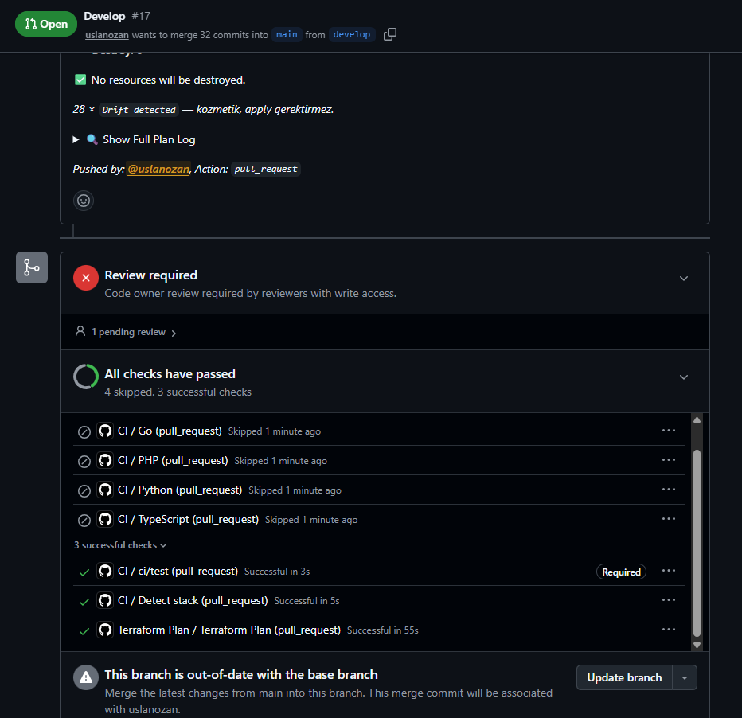

# Pilot Doğrulama Raporu — `pilot-intern-web`

**Tarih:** 2026-08-07
**Güncellemeler:** 2026-08-15 → Bölüm 6.3–6.4 (ret tarafı doğrulandı) ·
2026-08-16 → Bölüm 7 (GitOps döngüsü uçtan uca doğrulandı)
**Kapsam:** `terraform/modules/repository` modülünün uçtan uca doğrulanması
**Repo:** https://github.com/your-org/pilot-intern-web
_(Bölüm 6.3–6.4 testleri `Tidyorg` reposunda yapıldı; aynı modülden
aynı kurallarla üretildiği için sonuçlar tüm repo'lar için geçerlidir.)_

Bu rapor, konfigürasyondan repo üretme zincirinin gerçekten çalıştığını kanıtlar.
Sunumda "çalışıyor" demek yerine gösterilecek kayıt budur.

---

## 1. Ne Denendi

Tek bir YAML satırından — [`terraform/config/organization.yml`](../terraform/config/organization.yml) —
tam donanımlı bir repo üretilmesi:

```yaml
repositories:
  pilot-intern-web:
    description: "Pilot proje — repository modülünün uçtan uca doğrulanması"
    language: typescript
    mentors: [uslanozan]
    developers: [paitblack]
```

Geri kalan her şey (görünürlük, dallar, korumalar, label'lar, takımlar, CODEOWNERS)
`defaults` bölümünden miras alındı. Repo'ya özel tek bir kural yazılmadı.

> **Şema notu:** Yukarıdaki `repositories:` bloğu 2026-08-07 tarihindeki şemadır.
> Faz 1 ile (2026-08-15) repo tanımları ayrı dosyalara bölündü; bugünkü karşılığı
> `config/repositories/pilot-intern-web.yml` dosyasının içeriğidir — anahtar olarak repo
> adı yazılmaz, dosya adı repo adıdır. Güncel şema:
> [`config-guide.md`](config-guide.md).

**Sonuç:** `Apply complete! Resources: 25 added, 0 changed, 0 destroyed.`

---

## 2. Üretilen Kaynaklar

| Kaynak | Adet | Detay |
| :--- | :--- | :--- |
| Repo | 1 | `pilot-intern-web`, public |
| Dal | 2 | `main` (auto-init) + `develop` |
| Varsayılan dal ayarı | 1 | `develop` |
| Takım | 2 | `pilot-intern-web-mentors`, `pilot-intern-web-devs` |
| Takım üyeliği | 2 | Ozan → mentors (maintainer), Emre → devs (member) |
| Repo erişimi | 3 | mentors (admin), devs (write), platform-admins (admin) |
| Dal koruması | 2 | `main`, `develop` |
| Label seti | 13 | Tek `github_issue_labels` kaynağında |
| Dosya | 1 | `.github/CODEOWNERS` |

---

## 3. Doğrulama Sonuçları

Tamamı GitHub arayüzünden gözle kontrol edildi. Ekran görüntüleri
`docs/images/pilot-verification/` klasöründe, bu bölümdeki sıraya göre numaralıdır.

### Repo ve dallar
- [x] Repo oluştu, açıklama config'den geldi
- [x] Varsayılan dal **`develop`** — `main` değil
- [x] İki dal mevcut, 2 commit (initial + CODEOWNERS)


`auto_init` ile doğan `main` dalının üzerine `develop` açıldı ve varsayılan yapıldı.
İkinci commit, Terraform'un yazdığı CODEOWNERS dosyasına ait.

### CODEOWNERS
- [x] `.github/CODEOWNERS` dosyası repo'da mevcut
- [x] GitHub **"This CODEOWNERS file is valid"** doğrulaması geçti
- [x] İçerik doğru: `*  @your-org/pilot-intern-web-mentors`
- [x] Dosyanın Terraform tarafından üretildiği başlıkta belirtilmiş


> Bu dosya kritik: `require_code_owner_review` ayarı, repo'da CODEOWNERS yoksa
> hiçbir şey zorlamaz. Dosya olmadan `main` koruması kâğıt üstünde kalırdı.
>
> GitHub'ın yeşil **"This CODEOWNERS file is valid"** bandı önemli: bu dosyadaki
> sözdizimi hatası veya var olmayan bir takım adı sessizce yok sayılır, kural da
> uygulanmaz. Doğrulamanın geçmiş olması, takım adının doğru üretildiğini kanıtlar.

### Label'lar
- [x] Tam **13 label** — ne eksik ne fazla
- [x] Türkçe açıklamalar config'den geldi
- [x] GitHub'ın varsayılan label'ları (`documentation`, `duplicate`, `enhancement`,
      `invalid`, `question`, `wontfix`) **temizlendi**


Başlıktaki **"13 labels"** sayısı, çoğul `github_issue_labels` kaynağının repo'nun
label setini tam olarak yönettiğini gösterir (bkz. Bölüm 4.1).

### Yetkiler
- [x] `pilot-intern-web-devs` → **write**
- [x] `pilot-intern-web-mentors` → **admin**
- [x] `platform-admins` → **admin** (head-of-engineering rolü, organizasyon kapsamı)
- [x] Base role: **Read** — org üyeleri repo'yu görebiliyor ama yazamıyor


Üç takımın da **Direct access** sekmesinde görünmesi önemli: yetki organizasyon
genelinden değil, repo'ya doğrudan verilmiş durumda. `platform-admins` satırı
Bölüm 4.2'de anlatılan düzeltmeyle eklendi.

### Dal koruması — `develop`
- [x] PR zorunlu
- [x] **1 onay** gerekli
- [x] Stale review dismiss açık
- [x] Code Owners işareti **kapalı** → başka bir developer'ın onayı yeterli
- [x] Force push ve dal silme kapalı


### Dal koruması — `main`
- [x] PR zorunlu
- [x] **2 onay** gerekli
- [x] Stale review dismiss açık
- [x] **Require review from Code Owners** işaretli → mentör onayı zorunlu
- [x] Force push ve dal silme kapalı


> İki ekran görüntüsünü yan yana koyun: aynı modülden üretilen iki kural, farklı
> katılıkta. `main` iki onay ve mentör onayı isterken `develop` tek onayla yetiniyor.
> Bu fark config'deki `defaults` bölümünde bilinçli olarak tanımlandı ve "onay kuralı
> projeden projeye ve daldan dala değişebilir" tasarımının kanıtı.

---

## 4. Bulunan ve Düzeltilen Hatalar

Pilotun asıl değeri burada. İki gerçek kusur yalnızca canlı bir repo oluşturulunca
ortaya çıktı; ikisi de modülde kalıcı olarak düzeltildi.

> **Toplam beş kusur bulundu.** Bu bölümdeki üçü **modülde**, Bölüm 7.2'deki ikisi
> **GitOps katmanında** — ve beşi de yalnızca sistem gerçekten çalıştırılınca ortaya
> çıktı. Hiçbiri kod okuyarak fark edilemezdi.

### 4.1 Label çakışması (422 already_exists)

**Belirti:** İlk apply'da 23 kaynak oluştu, `good first issue` ve `help wanted`
label'ları hata verdi.

**Kök sebep:** GitHub yeni bir repo açarken kendi varsayılan label'larını da
oluşturuyor. Tekil `github_issue_label` kaynağı her label için "oluştur" çağrısı
yaptığından bu isimlerle çakıştı.

**Çözüm:** Çoğul `github_issue_labels` kaynağına geçildi. Bu kaynak repo'nun label
setinin tamamını yönetiyor: mevcutları güncelliyor, eksikleri ekliyor, listede
olmayanları siliyor. Yan fayda: GitHub'ın varsayılan label'ları da temizleniyor.

Geçiş sırasında `removed { lifecycle { destroy = false } }` bloğu kullanıldı —
ilk apply'da oluşan 11 label state'ten çıkarıldı ama GitHub'dan silinmedi, çoğul
kaynak onları devraldı. Gereksiz bir sil-yarat turu yaşanmadı.

### 4.2 Kalıcı drift — push izni yerleşmiyordu

**Belirti:** Apply başarılı olmasına rağmen her `plan` aynı iki branch protection
için "değişecek" diyordu. `push_allowances` listesinden
`your-org/platform-admins` sürekli geri düşüyordu.

**Kök sebep:** GitHub, bir takımı dal push izin listesine ancak **o takımın repo'ya
erişimi varsa** kabul ediyor. Erişimi yoksa isteği **hata vermeden yok sayıyor**.
Modül `platform-admins` takımına hiçbir repo yetkisi vermiyordu.

**Çözüm:** Modüle `github_team_repository.org_admins` eklendi. `head-of-engineering`
rolü zaten [`ACCESS-MODEL.md`](../ACCESS-MODEL.md)'de `scope: organization` ve tüm
repo'larda `admin` olarak tanımlıydı; modül bunu uygulamıyordu. Eksik olan buydu.

**Öğrenilen:** GitHub bazı istekleri sessizce yok sayıyor. Terraform olmasaydı
"push kısıtı koydum" sanıp devam edilirdi. Drift tespiti bunu ortaya çıkardı —
beyan temelli yönetimin somut faydası.

---

### 4.3 Satır sonu farkı — apply, çalıştıran makineye göre farklı sonuç üretiyordu

**Bulunma tarihi:** 2026-08-16 · Faz 2 sonrası ilk şablon güncellemesinde.

**Belirti:** Yalnızca `dependabot.yml` düzenlenmişken `plan` **18 dosyada** değişiklik
gösterdi. Diff'in iki tarafı da birebir aynıydı:

```
-       placeholder: Uploading an avatar larger than 2 MB returns a 500 …
+       placeholder: Uploading an avatar larger than 2 MB returns a 500 …
```

**Kök sebep:** Windows'ta `core.autocrlf = true`. Repo'daki `.gitattributes` dosyası
`* text=auto` ile içeriği LF olarak saklıyor, ama **checkout sırasında CRLF'e çeviriyor.**
Modül `file()` ile diski okuduğu için CRLF içerik gönderiyordu; GitHub'daki içerik LF'ti.
Sonuç: her `apply` tüm `strict` dosyaları "değişmiş" sayıp yeniden yazıyordu.

Doğrulaması net: aynı anda diskte `ci.yml` **CRLF**, `dependabot.yml` ise **LF**'ti —
çünkü ilki git checkout'undan gelmiş, ikincisi az önce elle yazılmıştı.

**Çözüm:** Modülde içerik normalize ediliyor —
`replace(file(...), "\r\n", "\n")`. Plan **18 → 3**'e düştü.

**Neden `.gitattributes` yetmedi:** o dosya deponun *içindeki* gösterimi düzenliyor,
çalışma dizinine çıkan hali değil. Normalizasyonun modülde olması ayrıca daha doğru:
bir kontrol düzlemi, apply'ı **kimin hangi işletim sisteminden çalıştırdığına göre farklı
sonuç üretmemeli.** Faz 8'de motor repo'sunu farklı makinelerden apply edecek olmamız bunu
zorunlu kılıyor.

**Öğrenilen:** Kusur, sistemi ilk kez *ikinci kez* çalıştırınca ortaya çıktı. İlk apply
temizdi çünkü karşılaştırılacak bir önceki hâl yoktu; sorun ancak bir şablon
**güncellendiğinde** görünür oldu. Yeni bir mekanizmayı yalnızca kurup doğrulamak yetmiyor,
bir kez de değiştirip tekrar çalıştırmak gerekiyor.

---

## 5. Ek Tespit — Commit Kimliği

CODEOWNERS commit'i GitHub'da **`paitblack`** adına görünüyor
([02-codeowners.png](images/pilot-verification/02-codeowners.png) — commit satırındaki
avatar ve kullanıcı adı). Sebebi, HCP Terraform workspace'inde tanımlı
`TF_VAR_github_token` değişkeninin Emre'nin kişisel access token'ı olması.
Terraform'un yaptığı her yazma işlemi bir kişinin adına kaydediliyor.

Sonuçları:
- Otomasyonun yaptığı değişiklikler bir insanın yaptıklarından ayırt edilemiyor
- Token sahibi ekipten ayrılırsa tüm otomasyon durur
- Denetim izinde "bunu kim yaptı" sorusunun cevabı yanıltıcı

Bu, [`docs/notes/github-auth-strategy.md`](notes/github-auth-strategy.md) içinde
önerilen **GitHub App**'e geçişin gerekçesini güçlendiriyor. App ile yapılan
commit'ler `tidyorg-bot` gibi ayrı bir kimlikle görünür ve kişiye bağımlılık ortadan
kalkar.

---

## 6. Davranış Testleri

### 6.1 `prevent_destroy` — ✅ Doğrulandı

Config'den repo tanımı geçici olarak çıkarıldı ve `terraform plan` çalıştırıldı:

```
Error: Instance cannot be destroyed

  on modules/repository/main.tf line 43:
  43: resource "github_repository" "this" {

Resource module.repositories["pilot-intern-web"].github_repository.this has
lifecycle.prevent_destroy set, but the plan calls for this resource to be
destroyed.
```

Terraform `plan` aşamasında durdu; `apply`'a hiç geçilmedi. Config testten hemen sonra
eski hâline döndürüldü.

**Kanıtladığı:** Dashboard'da biri bir repo satırını yanlışlıkla silerse repo yok olmaz.
Silme işlemi ancak modüldeki `lifecycle` bloğu bilinçli olarak kaldırılırsa mümkün.

### 6.2 Mentörün korumalı dala doğrudan yazması — ✅ Doğrulandı

`develop` dalına GitHub arayüzünden doğrudan commit atıldı. GitHub commit ekranında
uyarısını açıkça gösterdi ve işleme izin verdi:


**Kanıtladığı:** `enforce_admins: false` ayarı canlıda çalışıyor. Mentör rolündeki bir
kullanıcı korumalı dala doğrudan yazabiliyor ve GitHub bunu "kurallar bypass ediliyor"
diye açıkça bildiriyor. [`ACCESS-MODEL.md`](../ACCESS-MODEL.md)'de tanımlanan davranış bu.

> Bu ekran aynı zamanda tasarımın kabul edilmiş bir tavizini gösteriyor: mentöre bu gücü
> vermek, onun elle yaptığı değişikliklerin bir sonraki `apply` ile geri alınması pahasına
> geliyor. Kalıcı değişikliğin tek yolu konfigürasyondur.

### 6.3 Developer'ın korumalı dala doğrudan push'u — ✅ Reddedildi

**Tarih:** 2026-08-15 · **Repo:** `Tidyorg` · **Hesap:** `paitblack`

Raporun bu bölümü aylardır boştu; sebebi tek bir hesapla test edilememesiydi (bkz. 6.5).
Emre projeden ayrılınca `platform-admins` üyeliği kaldırıldı ve org rolü `member`a
sabitlendi — böylece elimizde ilk kez **gerçek bir `developer` hesabı** oldu. Aynı push
tekrar denendi:


```
remote: error: GH006: Protected branch update failed for refs/heads/develop.
remote: - Changes must be made through a pull request.
remote: - Required status check "ci/test" is expected.
remote: - You're not authorized to push to this branch.
```

**Kanıtladığı — üç ayrı şey:**

1. **PR zorunluluğu çalışıyor.** *"Changes must be made through a pull request."*
2. **`restrict_pushes` mevcut plan seviyesinde fiilen uygulanıyor.** *"You're not authorized
   to push to this branch."* Bu satır, açık kalan en önemli sorunun cevabıdır: free plan +
   public repo'da push izin listesi **gerçekten zorlanıyor**, sessizce yok sayılmıyor.
   Hafta 2'de "apply sırasında patlayabilir, patlarsa `push_allowed_roles` boşaltılacak"
   diye not düşülmüştü — gerek kalmadı.
3. **Aynı kullanıcı bir gün önce bu push'u başarıyla atmıştı.** Değişen tek şey rol
   ataması. Kural baştan doğruydu; kimin ondan muaf olduğu görünmüyordu.

> Karşılaştırma için 6.2'ye bakın: aynı dal, aynı kural, farklı rol. Mentör "kurallar
> bypass ediliyor" uyarısıyla geçiyor, developer `GH006` ile duruyor. İki ekran görüntüsü
> yan yana, `enforce_admins: false` tasarımının tam olarak amaçlandığı gibi çalıştığını
> gösteriyor.

### 6.4 Onay olmadan merge — ✅ Engellendi

**Tarih:** 2026-08-15 · **PR:** `Test4` #10 → `develop`

Push reddedilince aynı hesap kural gereği PR açtı:


- [x] **Review required** — *"At least 1 approving review is required by reviewers with
      write access."* `required_reviews: 1` canlıda zorlanıyor.
- [x] **Merging is blocked** — merge düğmesi kapalı; kullanıcı kendi PR'ını onaylayamıyor.
- [x] Kullanıcı adının yanındaki **`Member`** rozeti org rolünün `member` olduğunu
      doğruluyor — `github_membership` kaynağı yerleşmiş.
- [x] PR açma yetkisi korunmuş: developer engellenmiyor, **doğru kanala yönlendiriliyor.**

**Ayrıca görünen — `ci/test` blokajı:** *"ci/test · Expected — Waiting for status to be
reported"* satırı `Required` etiketiyle duruyor. Bu check hiçbir repoda üretilmiyor
(`terraform/templates/` henüz dağıtılmıyor), dolayısıyla **onay alınsa bile bu PR merge edilemez.**
Mentör admin muafiyetiyle geçtiği için bugüne kadar fark edilmedi; ilk kez normal developer
akışında görünür oldu. Kalıcı çözüm şablon dağıtımıdır — [`ROADMAP.md`](../ROADMAP.md) Faz 2.

### 6.5 Henüz doğrulanmayanlar

- [x] ~~CI workflow tetiklenmesi ve `ci/test` status check'inin **raporlanması**~~
      ✅ **2026-08-16'da doğrulandı** — şablon dağıtımı sonrası check ilk kez yeşil
      raporladı. Bkz. Bölüm 7.6.
- [x] ~~Force push denemesinin sonucu~~
      ✅ **Doğrulandı — sonuç role göre değişiyor:**

      | Rol | Sonuç |
      | :--- | :--- |
      | `developer` | ❌ **Reddedildi** — `allow_force_push: false` zorlanıyor |
      | `mentor` | ✅ **Geçti** — `enforce_admins = false` muafiyeti force push'u da kapsıyor |

      Yani mentör muafiyeti yalnızca PR/onay kurallarını değil, **force push korumasını da**
      kapsıyor. Karar E'nin kapsamı bu kadar geniş — [`rbac-and-permissions.md`](rbac-and-permissions.md)
      Bölüm 4'e işlendi.

- [~] `main`'de code owner (mentör) onayının zorunlu kılınması — **kısmen doğrulandı**

      **Gözlenen:** `developer` rolündeki hesap PR açtı ve **kendi PR'ını merge edemedi**
      (Bölüm 6.4, `develop` üzerinde).

      **Gözlenmeyen:** `develop`'ta `require_code_owner_review: false`. Yani o test
      "onay zorunluluğu"nu kanıtladı, **code owner mekanizmasını değil** — ikisi ayrı
      kural. `main`'de fazladan çalışan şey CODEOWNERS dosyası eşleşmesidir.

      **Neden risk düşük:** CODEOWNERS dosyasının geçerliliği bağımsız olarak doğrulandı
      (Bölüm 3 — GitHub'ın yeşil *"This CODEOWNERS file is valid"* bandı). Geçersiz bir
      takım adı sessizce yok sayılırdı; geçerli olması eşleşmenin çalışacağını gösterir.

      **Tam kanıt için gereken:** bir developer'ın `main`'e açtığı PR'ı **başka bir
      developer** onaylasın ve PR yine de bloklu kalsın. İki developer hesabı gerektiriyor.

Takip: [`TODO.md`](../TODO.md)

> **Bu bölümdeki gözlemler 2026-08-15 tarihlidir.** O tarihte modül CODEOWNERS'ı yazıyor
> ama workflow dosyalarını dağıtmıyordu. Workflow dağıtımı ertesi gün (Faz 2) devreye
> girdi; yukarıdaki 6.4 notu tarihsel kayıt olarak duruyor.

---

## 7. GitOps Döngüsü — Uçtan Uca Doğrulama

**Tarih:** 2026-08-16 · **PR:** `feat/gitops-templates` → `develop` · **Repo:** `Tidyorg`

`terraform-plan.yml` yazıldığından beri **bir kez bile çalışmamıştı** — dosya YAML olarak
geçersizdi (bkz. 7.2). Düzeltildikten sonra açılan ilk PR, döngünün ilk gerçek testi oldu.

### 7.1 Plan workflow'u tetiklendi ve yorum düştü — ✅


- [x] `pull_request` tetikleyicisi çalıştı — `paths` filtresi `terraform/**` ile eşleşti
- [x] Dört adım da geçti: **Format Check ✅ · Initialization ✅ · Validation ✅ · Plan ✅**
- [x] Plan **HCP Terraform'da uzaktan** koştu, çıktısı PR'a yorum olarak yazıldı
- [x] `Terraform Plan (pull_request) — Successful in 45s`


- [x] `No changes. Your infrastructure matches the configuration.` — elle yapılan apply ile
      kod birebir uyumlu
- [x] `Review required` kırmızı, `ci/test` **Expected — Waiting for status to be reported**
- [x] Alt bilgi doğru: `Pushed by: @uslanozan, Action: pull_request`

### 7.2 Bulunan iki kusur

Bölüm 4'teki iki kusur modülde bulunmuştu; bu ikisi GitOps katmanında çıktı.

**a) `terraform-plan.yml` geçersiz YAML'dı — dosya hiç çalışmamıştı**

91–109. satırlar `script: |` blok skalerinin dışına, sütun 0'a düşmüştü; YAML ayrıştırıcı
markdown tablosunun `| Step | Status |` satırını üst düzey anahtar sanıyordu.

**Kök sebep düşünüldüğünden ilginç:** satırları yalnızca içeri almak da çözmüyor — JS
template literal'in içindeki 12 boşluk string'e dahil olup markdown tablosunu kod bloğuna
çeviriyor. İki gereksinim çakışıyordu (YAML girinti ister, markdown istemez). Dosyayı yazan
kişi muhtemelen bu yüzden sola yaslamış. Çözüm: satır dizisi + `join('\n')`.

**Öğrenilen:** `tasks-ozan.md`'de Faz 3 "tamamlandı" işaretliydi. Bir workflow'un
**yazılmış olması çalıştığı anlamına gelmiyor** — Bölüm 6'yı bilerek "doğrulanmadı"
bırakma disiplininin kod tarafında uygulanmamış hâli.

**b) Temiz plan "özet bulunamadı" uyarısı veriyordu**

Yukarıdaki ekran görüntüsünde görünüyor: `⚠️ Plan summary line not found in output.`

Sebep: özet regex'i yalnızca `Plan: X to add, Y to change, Z to destroy` satırını arıyordu.
**Terraform o satırı değişiklik yokken hiç yazmıyor** — sadece `No changes.` diyor. Yani
sistem en sağlıklı olduğu anda uyarı üretiyordu; birkaç hafta sonra biri buna bakıp
"bir şey bozuldu" diye düşünecekti.

Düzeltme: `No changes` için ayrı bir dal eklendi. Ayrıca `Drift detected` satırları
sayılıp özete not olarak konuldu — log'daki duvarın kozmetik olduğunu açıklıyor
(bkz. 7.3). Her iki senaryo önce sahte plan çıktılarıyla render edilerek, ardından
**aynı PR'da canlı olarak** doğrulandı:

```
📊 Plan Summary
✅ No changes. Infrastructure matches the configuration.

26 × Drift detected — kozmetik, apply gerektirmez.
```

Aynı PR bu yüzden iki kez değerli oldu: hem döngünün çalıştığını gösterdi, hem de
düzeltmenin kendisini doğrulayan test ortamı oldu.

### 7.3 Drift gürültüsü — beklenen davranış


Her `plan` çıktısında onlarca `Drift detected (update)` satırı çıkıyor ve hiçbiri gerçek
değişiklik üretmiyor. Sebep: GitHub API bazı alanları provider'ın gönderdiğinden farklı
formatta geri döndürüyor (ör. takım açıklamasında boşluk normalleşmesi). Provider bunu
kayıt sayıyor, apply sırasında fark görmeyince geçiyor.

Tehlikesiz ama **gerçek değişiklikleri gölgeliyor** — bu yüzden özete sayı olarak eklendi.

> **Kozmetik olduğunun doğrudan kanıtı:** `medine2906` erişimi verildikten ~10 dakika
> sonra çalışan plan'da `github_membership.medine: Drift detected (update)` satırı çıktı.
> Kaynak yeni oluşturulmuştu ve o aralıkta kimse ona dokunmadı — sapma gerçek olsaydı
> mümkün değildi. Provider'ın okuduğu format ile gönderdiği format farklı, hepsi bu.

### 7.4 Kanıtlanan bir tasarım kararı — `develop`'a merge hiçbir şey uygulamaz

`terraform-apply.yml` yalnızca `main`'e push'ta tetikleniyor. Bu PR `develop`'a açıldığı
için **merge sonrası hiçbir apply çalışmadı** — beklenen davranış, çünkü değişiklikler
zaten elle apply edilmişti.

Ama bu tam olarak `develop`'un ürettiği sorunun canlı hâli: **kod merge görünüyor, canlıda
karşılığı yok.** Kontrol düzlemi repolarının trunk-based çalışması kararının
([`ROADMAP.md`](../ROADMAP.md) Karar F) dayandığı gözlem budur.


### 7.5 Yan tespit — PR şablonu gelmedi

PR açarken açıklama alanı **boş geldi.** `terraform/templates/.github/PULL_REQUEST_TEMPLATE.md`
yazılmış durumda ama hiçbir repo'ya dağıtılmıyor; GitHub şablonu repo'nun **kendi**
`.github/` klasöründen okur ve orada yalnızca `workflows/` var.

[`docs/onboarding.md`](onboarding.md)'deki *"PR şablonu otomatik dolar"* iddiasının neden
hâlâ yanlış olduğunun doğrudan kanıtı. Faz 2 (şablon dağıtımı) bunu kapatacak.

---

### 7.6 `ci/test` ilk kez yeşil — ✅

**Tarih:** 2026-08-16 · **PR:** `Develop` #17 → `main`

Şablon dağıtımı (Faz 2) sonrası `ci.yml` üç repoya da indi. `develop → main` PR'ında
check ilk kez raporlandı:



| Check | Sonuç |
| :--- | :--- |
| **`CI / ci/test`** `Required` | ✅ **Successful in 3s** |
| `CI / Detect stack` | ✅ Successful in 5s |
| `CI / Go` · `PHP` · `Python` · `TypeScript` | ⏭️ Skipped |
| `Terraform Plan` | ✅ Successful in 55s |
| **Toplam** | **All checks have passed** — 4 skipped, 3 successful |

**Kanıtladığı — Hafta 2'de verilen bir tasarım kararının doğruluğu.** `ci.yml`'deki
toplayıcı job, dil job'ları `skipped` dönse bile bunu **başarı sayacak** biçimde yazılmıştı.
Gerekçesi o zaman şuydu: *"yoksa tek dilli repoda check hiç raporlanmaz ve PR sonsuza kadar
bekler."* Bu repoda hiçbir dil manifesti yok — dört dil job'u da atlandı ve `ci/test` yine
de yeşil raporladı. Karar olmasaydı bu PR merge edilemezdi.

`ci/test` bugüne kadar hiçbir zaman raporlanmamıştı; bu, `require_status_checks` ayarının
ilk kez gerçek bir karşılığı olduğu an.

### 7.7 Zincirin tamamı çalıştı

`feat/gitops-templates → develop` (#11) → `develop → main` (#17). İkinci merge'de
`terraform-apply.yml` **yazıldığından beri ilk kez** tetiklendi.

Plan çıktısı `0 destroy` verdi ve `28 × Drift detected — kozmetik` notunu taşıdı — yani
bugün eklediğimiz drift sayacı da canlıda çalıştı.

### 7.8 ⚠️ En kritik bulgu — `main` aylardır canlıdan kopmuştu

Testi planlarken fark edildi ve raporun bu bölümdeki en önemli maddesi:

| | Durum |
| :--- | :--- |
| `main`, `develop`'ın gerisinde | **24 commit** |
| `main`'de `terraform/` kökü | **yalnızca `modules/`** — `main.tf`, `repositories.tf`, `config/` hiçbiri yok |
| `terraform-apply.yml` | Yazıldığından beri **hiç çalışmamıştı** |

Yani apply workflow'u aylardır sessizce bekliyordu ve **çalışsaydı yıkıcı olacaktı.**
`develop → main` merge'ü, `feat/gitops-templates` daha `develop`'a inmeden yapılsaydı,
apply eski kodla koşacaktı:

| Terraform ne görürdü | Ne yapardı | Sonuç |
| :--- | :--- | :--- |
| `emre_admin` kodda var, state'te yok | ➕ CREATE | 🔴 Projeden ayrılan kullanıcı **`platform-admins`'e geri eklenirdi** — her repoda admin, bypass yetkisiyle |
| `github_membership.emre` / `.medine` state'te var, kodda yok | ➖ DESTROY | Org rolü beyanları kalkardı |
| 27 × `github_repository_file` state'te var, kodda yok | ➖ DESTROY | 🔴 Dağıtılan **27 dosyanın hepsi silinirdi** |

Doğru sıra (`feat → develop`, sonra `develop → main`) bilinçli olarak uygulandı ve apply
`0 destroy` ile geçti.

**Neden bu kadar önemli:** iki dallı akış, apply'ı yalnızca `main`'e bağlayınca **kod ile
canlının aylarca ayrışmasına izin verdi ve kimse fark etmedi.** `develop`'a merge edilen
her şey "yapıldı" görünüyordu; canlıda karşılığı yoktu. Bu, kontrol düzlemi repolarının
trunk-based çalışması kararının ([`ROADMAP.md`](../ROADMAP.md) Karar F) dayandığı gözlemin
en somut kanıtı — ve Faz 8'de repo ayrımının neden yapıldığının da yarısı.

---

## 9. Erişim İzolasyonu ve Org Ayarları — 2026-08-18

Bu bölüm, org düzlemine yapılan değişikliklerin canlı doğrulamasıdır. Öncekilerden farkı:
buradaki testlerin konusu **repo kuralları değil, organizasyonun kendisi**.

### 9.1 `default_repository_permission` = `none` — ✅ Doğrulandı

**Değişiklik:** org taban yetkisi `read` → `none`. Öncesinde org'a eklenen herkes, hiçbir
takımda olmasa bile **bütün repo'ları okuyabiliyordu**. Artık erişimin tek kaynağı takım
üyeliği.

**Test kurulumu — kontrol grubu bilerek tasarlandı.** `pilot-access-test` adında yeni bir
repo config'den açıldı; `mentors: [uslanozan]`, `developers: []`, yani **kimseye yetki
verilmedi**.

> ⚠️ **`visibility: private` zorunluydu, yoksa test geçersiz olurdu.** `defaults.visibility`
> `public` ve public repo'yu internetteki herkes görür — görebilmeleri base permission'dan
> değil public olmasından gelirdi. Bu, testi kurarken az kalsın kaçırılan bir hataydı.
>
> Bedeli: free plan'de private repo'da branch protection çalışmıyor, bu yüzden repo'nun
> `protected_branches` ayarları `null` ile kaldırıldı. Dal koruması zaten diğer üç repo'da
> doğrulanmıştı (Bölüm 6).

**Sonuç — 2026-08-18, iki ayrı hesaptan teyit alındı:**

| Hesap | Takım üyeliği | Beklenen | Gözlenen |
| :--- | :--- | :--- | :--- |
| `paitblack` | 3 repo'da developer | O 3 repo görünür, `pilot-access-test` **404** | ✅ Beklendiği gibi |
| `medine2906` | 1 repo'da developer | Yalnızca o repo; diğer 3'ü **404** | ✅ Beklendiği gibi |

`medine2906`'nın **iki pilot repo'yu kaybetmesi** bu testin asıl kanıtı: o erişim bir takım
üyeliğinden değil, **org varsayılanından** geliyordu. Varsayılan kalkınca erişim de kalktı.

**Bağımsız teyit — organizasyon People ekranı.** Takım sayıları config ile birebir uyuşuyor;
yani yetkinin tek kaynağının takım üyeliği olduğu sayısal olarak da görünüyor:

| Kişi | Takım | Karşılığı |
| :--- | :--- | :--- |
| `medine2906` | 1 | `Tidyorg` devs |
| `paitblack` | 3 | Üç repo'da developer |
| `uslanozan` | 5 | `platform-admins` + 4 repo mentors |

> ⚠️ **Bu, beklenen ama bedeli olan bir sonuçtur.** Dashboard org'daki repo'ları kullanıcının
> kendi kimliğiyle listeliyor (ACCESS-MODEL Karar 15), yani Medine'nin ekranından iki repo
> kayboldu. Test sırasında "dashboard bozuldu" sanılabilir; bozulmadı.
>
> **Alınan ders:** taban yetkiyi daraltmak sessiz bir ayar değişikliği değil, bir **erişim
> kaldırma** işlemidir. "Bu varsayılana kim bağımlı?" sorusu apply'dan *önce* cevaplanmalıydı;
> bu kez sonra bakıldı.

### 9.2 Repo açma kısıtı GitHub App'i etkilemiyor — ✅ Doğrulandı

**Değişiklik:** `members_can_create_repositories = false` (üç alt anahtarıyla birlikte).
Artık yalnızca org owner elle repo açabilir.

**Risk:** eğer bu ayar App'i de kısıtlasaydı **config'den repo yaratma tamamen bozulurdu** —
yani projenin ana akışı. Varsayım "App org üyesi değil, kurulu bir entegrasyon" idi ama
doğrulanmamıştı.

**Test:** kısıt yürürlükteyken geçici bir repo config'den yaratıldı.

```
module.repositories["tmp-app-create-test"].github_repository.this:
  Creation complete after 11s [id=tmp-app-create-test]
Apply complete! Resources: 11 added, 0 changed, 0 destroyed.
```

**Sonuç:** ayar org **üyelerini** kısıtlıyor; App kendi izinleriyle çalışıyor. Kısıtın aldığı
şekil tam olarak istenen: **insan elle açamıyor, config açabiliyor.**

### 9.3 Yol açılırken çıkan üçüncü 403 — App izin sınıfları ayrı

Org ayarlarını yönetmenin ilk apply denemesi şu hatayla durdu:

```
Error: PATCH https://api.github.com/orgs/your-org:
       403 Resource not accessible by integration
```

App'te `Repository → Administration: write` **vardı**. Ama org ayarları için gereken izin o
değil:

| Manifest anahtarı | Neyi açar |
| :--- | :--- |
| `administration` | Repo ayarları, branch protection, takım erişimi |
| `organization_administration` | **Org ayarları**, base permission, üye izinleri |

**Bu, `Issues` ve `Workflows` 403'lerinin üçüncüsü.** Üçünde de sebep aynı: geniş sanılan bir
izin GitHub tarafında daha dar tanımlanmış. Yeni bir kaynak türüne ilk kez dokunulurken bu
403 beklenmelidir — hata değil, en az yetkiyle kurulmuş bir App'in normal davranışı.

### 9.4 Import'un ortaya çıkardıkları — test değil, keşif

`github_organization_settings` Terraform'a `import` bloğuyla alındı ve `plan` ile provider
varsayılanı/gerçek farkı okundu. Amaç tek bir alanı değiştirmekti; çıktı dört bulgu verdi:

| Bulgu | Durum |
| :--- | :--- |
| Altı org güvenlik varsayılanının **hepsi kapalı** | Beşi açıldı; `advanced_security` GHAS ister, bilerek kapalı |
| Org üyeleri **public repo açabiliyor** | Kapatıldı |
| Fatura e-postası **ayrılan ekip üyesinde** | Düzeltildi ve Terraform'a alındı |
| `vulnerability_alerts` **bu repo'da kapalı** | Açıldı |

Son satır en çok ders çıkaranı: **kontrol düzleminin kendisi** aylardır Dependabot zafiyet
uyarısı almıyormuş. Sebep, bu repo'nun Terraform'dan **önce elle** açılmış olması; pilot
repo'lar modülden doğduğu için onlarda açıktı.

> **Yöntem notu:** `import` burada bir "state'e alma" mekaniği olarak kullanıldı ama asıl işi
> **keşif** oldu. Terraform'a hiç bağlanmamış bir kaynağı import edip plan almak, o kaynağın
> gerçek durumunu **hiçbir şeyi değiştirmeden** okumanın en ucuz yolu.

### 9.5 Org üyeliği doğrulamaları — ✅ İkisi de canlı test edildi

`people` bölümü Terraform'a bağlandıktan sonra eklenen `precondition`'lar, hatalı config ile
denenerek gerçekten çalıştıkları görüldü.

| Test | Girdi | Sonuç |
| :--- | :--- | :--- |
| Geçersiz `org_role` | `org_role: owner` | ✅ Plan durdu — arayüz/API isim farkı açıklandı |
| Yönetim dışı üye | Repo dosyasında olup `people.yml`'da olmayan kullanıcı | ✅ Plan durdu, eksik isim raporlandı |
| Yanlış kapsamda rol | `people.roles: [developer]` | ✅ Plan durdu, hatalı atama raporlandı |

`org_role: owner` testi bir tuzağı ortaya çıkardı: **GitHub arayüzü bu rolü "Owner" diye
gösterir, API `admin` ister.** Doğrulama olmasaydı bu değer plan'ı geçip **apply sırasında**
patlardı — yani hata, değişiklik canlıya uygulanırken çıkardı.

> **Yöntem notu:** ikinci doğrulama ilk yazıldığında **yanlış hata mesajı** üretiyordu;
> kaynak, precondition çalışmadan önce çöküyordu. Yalnızca test edildiği için fark edildi.
> **Ateşlendiği görülmemiş bir doğrulama, yazılmış sayılmaz.**

### 9.6 Yol bazlı CODEOWNERS — ✅ Canlı doğrulandı (kendiliğinden)

Bölüm 9.7'de "canlı denenmedi" diye not düşülecek olan kural, eklendiği gün kendiliğinden
denendi. Kanıt, açık duran Dependabot PR'ında (#18):

```
dependabot Bot requested a review from
  your-org/tidyorg-github-infrastructure-mentors as a code owner  · 3 gün önce
  your-org/platform-admins                     as a code owner  · 11 dakika önce
```

PR üç gün önce açıldığında yalnızca varsayılan sahiplik (`*` → repo mentörleri) geçerliydi.
2026-08-19'da `/.github/workflows/` yolu `platform-admins`'e bağlanınca GitHub **yeni bir
review isteği üretti** — çünkü PR o yolun altındaki dosyalara dokunuyor.

**Bloklama da işliyor:**

```
Merging is blocked
Waiting on code owner review from your-org/platform-admins.
```

**Ve Karar E'nin görünür kanıtı aynı ekranda:**

```
Merge without waiting for requirements to be met (bypass rules)
```

Kural repo admin'ini de bloklıyor, ancak bypass düğmesi önünde duruyor. `enforce_admins = false`
kararının pratikteki hâli tam olarak budur: kural **görünür ve varsayılan olarak zorlayıcı**,
ama muafiyet bir tık uzakta.

### 9.7 🔴 Dependabot ile `strict` şablonlar çakışıyor — 2026-08-19

Aynı PR ikinci bir sorunu ortaya çıkardı.

**Gözlenen:** `Terraform Plan` check'i **9 saniyede** kırmızı yandı.

**Sebep:** GitHub, Dependabot'un açtığı PR'lara normal Actions secret'larını **vermez** —
ayrı bir kasa kullanır (Settings → Secrets → Dependabot). `secrets.TF_API_TOKEN` boş geldiği
için `terraform init` HCP'ye bağlanamadan patlıyor. 9 saniye de "checkout + setup + init
başarısız" süresine denk düşüyor.

**Alınan önlem:** job Dependabot PR'larında atlanıyor. Koşul PR'ın **sahibine** bakıyor (`github.event.pull_request.user.login`), tetikleyene değil — ilk yazımda `github.actor` kullanılmıştı ve bu yanlıştı: bir insan "Re-run jobs" dediğinde değer o insan olur, koşul geçer ve job yine patlar, çünkü GitHub secret kısıtını PR'ı AÇANA göre uygular.
Token'ı ikinci bir kasaya yaymak yerine bu seçildi; Dependabot bu repo'da yalnızca action
sürümlerini yükseltiyor, `terraform/` altına dokunmuyor — plan çalışsa `No changes` derdi.
Job zorunlu status check değil, atlanması PR'ı bloklamaz.

**İkinci ve daha önemli bulgu — sessiz bir geri alma döngüsü.** PR üç dosya değiştiriyor;
ikisi elle yazılmış (`terraform-plan.yml`, `terraform-apply.yml`) ama üçüncüsü
`.github/workflows/ci.yml` ve o **`strict` modda Terraform'a ait**:

```
PR merge edilir  → ci.yml v7 olur
bir sonraki apply → şablondan v4 geri yazılır
Dependabot        → aynı PR'ı yeniden açar
```

Kaynak dosya `terraform/templates/.github/workflows/ci.yml` ve **Dependabot orayı göremiyor**:
`github-actions` ekosistemi yalnızca gerçek `.github/workflows/` klasörünü tarar,
`terraform/templates/` altındakiler onun için sıradan YAML dosyalarıdır.

**Alınan önlem:** PR'ın verdiği sürümler şablonlara elle taşındı. Kalıcı çözüm kararı
açık — bkz. [`TODO.md`](../TODO.md).

> **Alınan ders:** bir dosyanın içeriğini Terraform sahipleniyorsa, o dosyayı güncelleyen
> her otomasyon (Dependabot, bot, agent) **kaynağı değil kopyayı** görür. Kopyaya yapılan
> her değişiklik bir sonraki apply'da kaybolur — hata vermeden, sessizce.

### 9.8 🔴 Örnek config'deki takma adlara gerçek davet gitmiş — 2026-08-15

`people` bölümü Terraform'a bağlanırken koda şu uyarı yazılmıştı:

> `config/organization.example.yml` asla `for_each`'e sokulmamalı: içindeki `mentor-a`,
> `dev-1` gibi örnek kullanıcılara **gerçek davet gider**.

Uyarı teorik olarak yazıldı. 2026-08-19'da organizasyonun **Invitations** sekmesinde
görüldü ki bu çoktan olmuş:

| Davet edilen | Tarih | Durum |
| :--- | :--- | :--- |
| `Dev-1` | 2026-08-15 | Bekliyor — iptal edildi |
| `dev-2` | 2026-08-15 | Bekliyor — iptal edildi |

**Sebep:** şema örneğindeki takma adlar (`dev-1`, `dev-2`) **gerçek GitHub kullanıcı
adları**. O hesapların sahibi olan yabancı iki kişiye private bir organizasyona davet
gitmiş. `mentor-a`, `mentor-b`, `dev-3` muhtemelen kayıtlı hesap olmadığı için "Failed
invitations" tarafına düşmüş.

**Neden dört gün fark edilmedi:** bekleyen davetler People ekranının ayrı bir sekmesinde
duruyor ve üye sayısına dahil değil. Bakılacak bir yer olmadığı için görünmüyorlardı —
bu oturumun tekrar eden temasının bir örneği daha.

**Kabul edilselerdi ne olurdu:** org'a `member` olarak katılırlardı ve `people.yml`'da
karşılıkları olmadığı için **hiçbir raporda görünmezlerdi**. 2026-08-18'de eklenen
fail-fast doğrulaması bunu artık config tarafında engelliyor — ama davet zaten
gönderilmişse doğrulama devreye girmez, çünkü daveti Terraform üretmedi.

**Alınan önlem — aynı hatanın repo tarafındaki karşılığı kapatıldı.** `repositories.tf`
şu klasörü `*.yml` ile tarıyordu:

```
config/repositories/
```

Bu klasördeki **her dosya gerçek bir repo yaratır**. Şema örneği niyetine buraya konan bir
dosya `repository.example` adında canlı bir repo açardı. Glob'a `.example.yml` istisnası
eklendi ve örnek dosya klasöre kopyalanıp `plan` ile doğrulandı: `No changes`.

> **Alınan ders:** örnek/şablon dosyalardaki *placeholder* değerler zararsız değildir.
> Gerçek bir isim alanında (GitHub kullanıcı adları, repo adları) her placeholder aslında
> **var olabilecek bir kimliktir**. Örnek dosyalar motorun okuduğu yollardan fiziksel
> olarak uzak tutulmalı, ayrıca kod seviyesinde dışlanmalıdır.

### 9.9 Açık kalan

- [ ] **`main` akışında code owner testi** — Bölüm 6.5'teki durumunu koruyor: iki developer
      hesabı gerekiyor.
      _Not: yol bazlı CODEOWNERS kuralları bu maddeden bağımsız olarak doğrulandı — bkz. 9.6._
- [ ] **Bu bölümdeki değişikliklerin GitOps döngüsünden geçmesi** — 9.1–9.5'teki apply'lar
      **lokalden** çalıştırıldı. `main`'e push edildiğinde `terraform-apply.yml`'ın
      `No changes` demesi beklenir; farklı bir sonuç, lokal ve CI ortamlarının ayrıştığını
      gösterir.

---

## 8. Doğrulamayı Tekrarlamak

```powershell
terraform -chdir=terraform plan
```

Beklenen çıktı:

```
No changes. Your infrastructure matches the configuration.
```

Bundan farklı bir çıktı, ya birinin GitHub arayüzünden elle değişiklik yaptığını
ya da modülde yerleşmeyen bir ayar kaldığını gösterir. İkisi de incelenmelidir.
