# Pilot Doğrulama Raporu — `pilot-intern-web`

**Tarih:** 2026-08-07
**Güncellemeler:** 2026-08-15 → Bölüm 6.3–6.4 (ret tarafı doğrulandı) ·
2026-08-16 → Bölüm 7 (GitOps döngüsü uçtan uca doğrulandı)
**Kapsam:** `terraform/modules/repository` modülünün uçtan uca doğrulanması
**Repo:** https://github.com/your-org/pilot-intern-web
_(Bölüm 6.3–6.4 testleri `Tidyorg` reposunda yapıldı; aynı modülden
aynı kurallarla üretildiği için sonuçlar tüm repo'lar için geçerlidir.)_

Bu rapor, konfigürasyondan repo üretme zincirinin gerçekten çalıştığını kanıtlar.
Sunumda "çalışıyor" demek yerine gösterilecek kayıt budur.

---

## 1. Ne Denendi

Tek bir YAML satırından — [`terraform/config/organization.yml`](../terraform/config/organization.yml) —
tam donanımlı bir repo üretilmesi:

```yaml
repositories:
  pilot-intern-web:
    description: "Pilot proje — repository modülünün uçtan uca doğrulanması"
    language: typescript
    mentors: [uslanozan]
    developers: [paitblack]
```

Geri kalan her şey (görünürlük, dallar, korumalar, label'lar, takımlar, CODEOWNERS)
`defaults` bölümünden miras alındı. Repo'ya özel tek bir kural yazılmadı.

**Sonuç:** `Apply complete! Resources: 25 added, 0 changed, 0 destroyed.`

---

## 2. Üretilen Kaynaklar

| Kaynak | Adet | Detay |
| :--- | :--- | :--- |
| Repo | 1 | `pilot-intern-web`, public |
| Dal | 2 | `main` (auto-init) + `develop` |
| Varsayılan dal ayarı | 1 | `develop` |
| Takım | 2 | `pilot-intern-web-mentors`, `pilot-intern-web-devs` |
| Takım üyeliği | 2 | Ozan → mentors (maintainer), Emre → devs (member) |
| Repo erişimi | 3 | mentors (admin), devs (write), platform-admins (admin) |
| Dal koruması | 2 | `main`, `develop` |
| Label seti | 13 | Tek `github_issue_labels` kaynağında |
| Dosya | 1 | `.github/CODEOWNERS` |

---

## 3. Doğrulama Sonuçları

Tamamı GitHub arayüzünden gözle kontrol edildi. Ekran görüntüleri
`docs/images/pilot-verification/` klasöründe, bu bölümdeki sıraya göre numaralıdır.

### Repo ve dallar
- [x] Repo oluştu, açıklama config'den geldi
- [x] Varsayılan dal **`develop`** — `main` değil
- [x] İki dal mevcut, 2 commit (initial + CODEOWNERS)

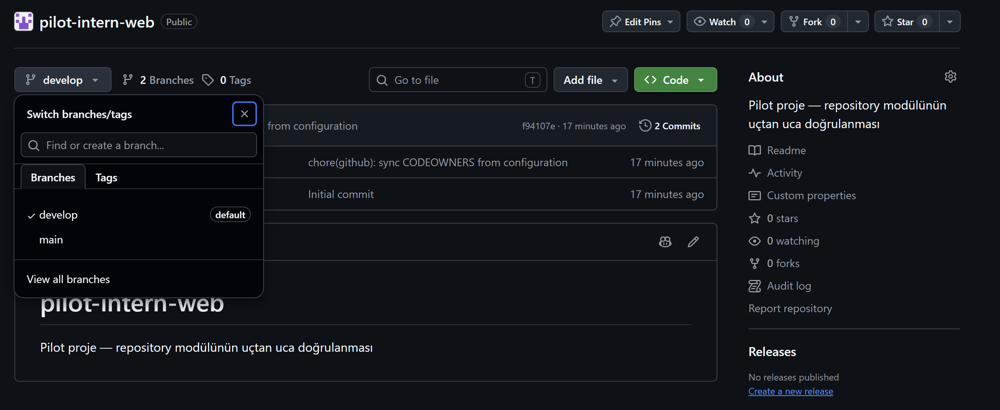

`auto_init` ile doğan `main` dalının üzerine `develop` açıldı ve varsayılan yapıldı.
İkinci commit, Terraform'un yazdığı CODEOWNERS dosyasına ait.

### CODEOWNERS
- [x] `.github/CODEOWNERS` dosyası repo'da mevcut
- [x] GitHub **"This CODEOWNERS file is valid"** doğrulaması geçti
- [x] İçerik doğru: `*  @your-org/pilot-intern-web-mentors`
- [x] Dosyanın Terraform tarafından üretildiği başlıkta belirtilmiş

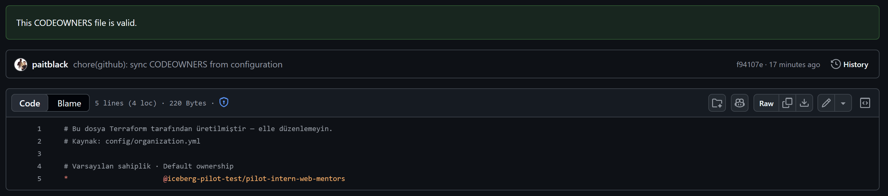

> Bu dosya kritik: `require_code_owner_review` ayarı, repo'da CODEOWNERS yoksa
> hiçbir şey zorlamaz. Dosya olmadan `main` koruması kâğıt üstünde kalırdı.
>
> GitHub'ın yeşil **"This CODEOWNERS file is valid"** bandı önemli: bu dosyadaki
> sözdizimi hatası veya var olmayan bir takım adı sessizce yok sayılır, kural da
> uygulanmaz. Doğrulamanın geçmiş olması, takım adının doğru üretildiğini kanıtlar.

### Label'lar
- [x] Tam **13 label** — ne eksik ne fazla
- [x] Türkçe açıklamalar config'den geldi
- [x] GitHub'ın varsayılan label'ları (`documentation`, `duplicate`, `enhancement`,
      `invalid`, `question`, `wontfix`) **temizlendi**

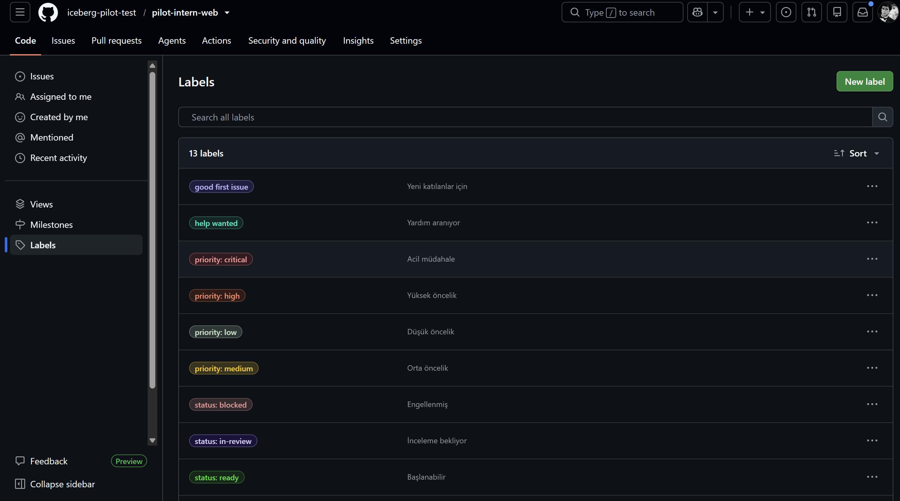

Başlıktaki **"13 labels"** sayısı, çoğul `github_issue_labels` kaynağının repo'nun
label setini tam olarak yönettiğini gösterir (bkz. Bölüm 4.1).

### Yetkiler
- [x] `pilot-intern-web-devs` → **write**
- [x] `pilot-intern-web-mentors` → **admin**
- [x] `platform-admins` → **admin** (head-of-engineering rolü, organizasyon kapsamı)
- [x] Base role: **Read** — org üyeleri repo'yu görebiliyor ama yazamıyor

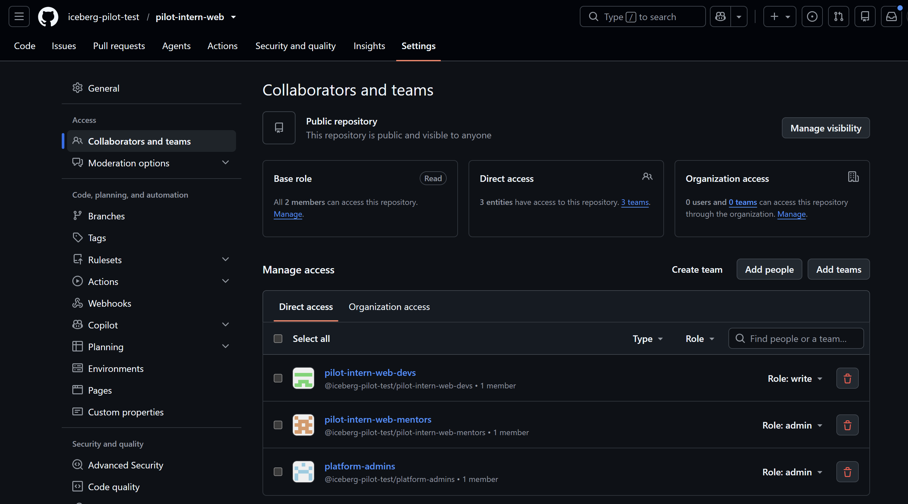

Üç takımın da **Direct access** sekmesinde görünmesi önemli: yetki organizasyon
genelinden değil, repo'ya doğrudan verilmiş durumda. `platform-admins` satırı
Bölüm 4.2'de anlatılan düzeltmeyle eklendi.

### Dal koruması — `develop`
- [x] PR zorunlu
- [x] **1 onay** gerekli
- [x] Stale review dismiss açık
- [x] Code Owners işareti **kapalı** → başka bir developer'ın onayı yeterli
- [x] Force push ve dal silme kapalı

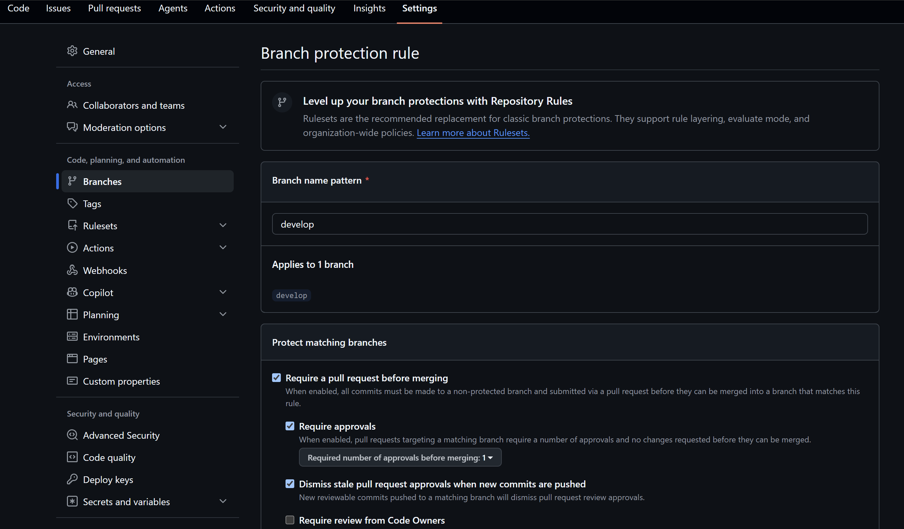

### Dal koruması — `main`
- [x] PR zorunlu
- [x] **2 onay** gerekli
- [x] Stale review dismiss açık
- [x] **Require review from Code Owners** işaretli → mentör onayı zorunlu
- [x] Force push ve dal silme kapalı

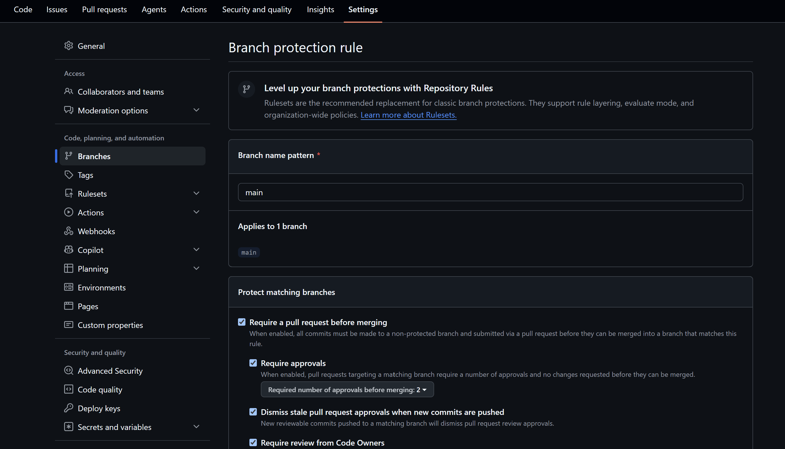

> İki ekran görüntüsünü yan yana koyun: aynı modülden üretilen iki kural, farklı
> katılıkta. `main` iki onay ve mentör onayı isterken `develop` tek onayla yetiniyor.
> Bu fark config'deki `defaults` bölümünde bilinçli olarak tanımlandı ve "onay kuralı
> projeden projeye ve daldan dala değişebilir" tasarımının kanıtı.

---

## 4. Bulunan ve Düzeltilen Hatalar

Pilotun asıl değeri burada. İki gerçek kusur yalnızca canlı bir repo oluşturulunca
ortaya çıktı; ikisi de modülde kalıcı olarak düzeltildi.

> **Toplam dört kusur bulundu.** Bu bölümdeki ikisi **modülde**, Bölüm 7.2'deki ikisi
> **GitOps katmanında** — ve dördü de yalnızca sistem gerçekten çalıştırılınca ortaya
> çıktı. Hiçbiri kod okuyarak fark edilemezdi.

### 4.1 Label çakışması (422 already_exists)

**Belirti:** İlk apply'da 23 kaynak oluştu, `good first issue` ve `help wanted`
label'ları hata verdi.

**Kök sebep:** GitHub yeni bir repo açarken kendi varsayılan label'larını da
oluşturuyor. Tekil `github_issue_label` kaynağı her label için "oluştur" çağrısı
yaptığından bu isimlerle çakıştı.

**Çözüm:** Çoğul `github_issue_labels` kaynağına geçildi. Bu kaynak repo'nun label
setinin tamamını yönetiyor: mevcutları güncelliyor, eksikleri ekliyor, listede
olmayanları siliyor. Yan fayda: GitHub'ın varsayılan label'ları da temizleniyor.

Geçiş sırasında `removed { lifecycle { destroy = false } }` bloğu kullanıldı —
ilk apply'da oluşan 11 label state'ten çıkarıldı ama GitHub'dan silinmedi, çoğul
kaynak onları devraldı. Gereksiz bir sil-yarat turu yaşanmadı.

### 4.2 Kalıcı drift — push izni yerleşmiyordu

**Belirti:** Apply başarılı olmasına rağmen her `plan` aynı iki branch protection
için "değişecek" diyordu. `push_allowances` listesinden
`your-org/platform-admins` sürekli geri düşüyordu.

**Kök sebep:** GitHub, bir takımı dal push izin listesine ancak **o takımın repo'ya
erişimi varsa** kabul ediyor. Erişimi yoksa isteği **hata vermeden yok sayıyor**.
Modül `platform-admins` takımına hiçbir repo yetkisi vermiyordu.

**Çözüm:** Modüle `github_team_repository.org_admins` eklendi. `head-of-engineering`
rolü zaten [`ACCESS-MODEL.md`](../ACCESS-MODEL.md)'de `scope: organization` ve tüm
repo'larda `admin` olarak tanımlıydı; modül bunu uygulamıyordu. Eksik olan buydu.

**Öğrenilen:** GitHub bazı istekleri sessizce yok sayıyor. Terraform olmasaydı
"push kısıtı koydum" sanıp devam edilirdi. Drift tespiti bunu ortaya çıkardı —
beyan temelli yönetimin somut faydası.

---

## 5. Ek Tespit — Commit Kimliği

CODEOWNERS commit'i GitHub'da **`paitblack`** adına görünüyor
([02-codeowners.png](images/pilot-verification/02-codeowners.png) — commit satırındaki
avatar ve kullanıcı adı). Sebebi, HCP Terraform workspace'inde tanımlı
`TF_VAR_github_token` değişkeninin Emre'nin kişisel access token'ı olması.
Terraform'un yaptığı her yazma işlemi bir kişinin adına kaydediliyor.

Sonuçları:
- Otomasyonun yaptığı değişiklikler bir insanın yaptıklarından ayırt edilemiyor
- Token sahibi ekipten ayrılırsa tüm otomasyon durur
- Denetim izinde "bunu kim yaptı" sorusunun cevabı yanıltıcı

Bu, [`docs/notes/github-auth-strategy.md`](notes/github-auth-strategy.md) içinde
önerilen **GitHub App**'e geçişin gerekçesini güçlendiriyor. App ile yapılan
commit'ler `tidyorg-bot` gibi ayrı bir kimlikle görünür ve kişiye bağımlılık ortadan
kalkar.

---

## 6. Davranış Testleri

### 6.1 `prevent_destroy` — ✅ Doğrulandı

Config'den repo tanımı geçici olarak çıkarıldı ve `terraform plan` çalıştırıldı:

```
Error: Instance cannot be destroyed

  on modules/repository/main.tf line 43:
  43: resource "github_repository" "this" {

Resource module.repositories["pilot-intern-web"].github_repository.this has
lifecycle.prevent_destroy set, but the plan calls for this resource to be
destroyed.
```

Terraform `plan` aşamasında durdu; `apply`'a hiç geçilmedi. Config testten hemen sonra
eski hâline döndürüldü.

**Kanıtladığı:** Dashboard'da biri bir repo satırını yanlışlıkla silerse repo yok olmaz.
Silme işlemi ancak modüldeki `lifecycle` bloğu bilinçli olarak kaldırılırsa mümkün.

### 6.2 Mentörün korumalı dala doğrudan yazması — ✅ Doğrulandı

`develop` dalına GitHub arayüzünden doğrudan commit atıldı. GitHub commit ekranında
uyarısını açıkça gösterdi ve işleme izin verdi:

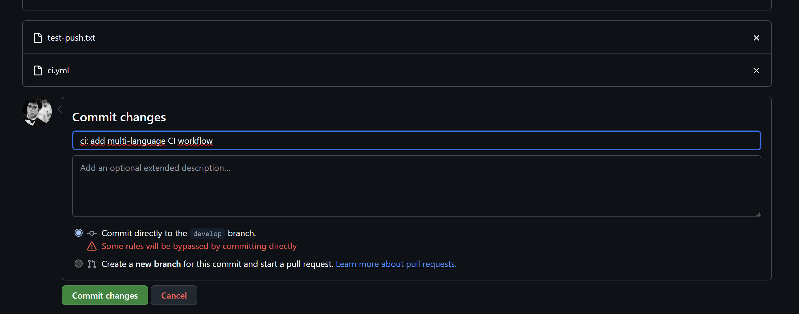

**Kanıtladığı:** `enforce_admins: false` ayarı canlıda çalışıyor. Mentör rolündeki bir
kullanıcı korumalı dala doğrudan yazabiliyor ve GitHub bunu "kurallar bypass ediliyor"
diye açıkça bildiriyor. [`ACCESS-MODEL.md`](../ACCESS-MODEL.md)'de tanımlanan davranış bu.

> Bu ekran aynı zamanda tasarımın kabul edilmiş bir tavizini gösteriyor: mentöre bu gücü
> vermek, onun elle yaptığı değişikliklerin bir sonraki `apply` ile geri alınması pahasına
> geliyor. Kalıcı değişikliğin tek yolu konfigürasyondur.

### 6.3 Developer'ın korumalı dala doğrudan push'u — ✅ Reddedildi

**Tarih:** 2026-08-15 · **Repo:** `Tidyorg` · **Hesap:** `paitblack`

Raporun bu bölümü aylardır boştu; sebebi tek bir hesapla test edilememesiydi (bkz. 6.5).
Emre projeden ayrılınca `platform-admins` üyeliği kaldırıldı ve org rolü `member`a
sabitlendi — böylece elimizde ilk kez **gerçek bir `developer` hesabı** oldu. Aynı push
tekrar denendi:

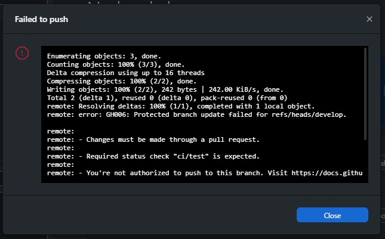

```
remote: error: GH006: Protected branch update failed for refs/heads/develop.
remote: - Changes must be made through a pull request.
remote: - Required status check "ci/test" is expected.
remote: - You're not authorized to push to this branch.
```

**Kanıtladığı — üç ayrı şey:**

1. **PR zorunluluğu çalışıyor.** *"Changes must be made through a pull request."*
2. **`restrict_pushes` mevcut plan seviyesinde fiilen uygulanıyor.** *"You're not authorized
   to push to this branch."* Bu satır, açık kalan en önemli sorunun cevabıdır: free plan +
   public repo'da push izin listesi **gerçekten zorlanıyor**, sessizce yok sayılmıyor.
   Hafta 2'de "apply sırasında patlayabilir, patlarsa `push_allowed_roles` boşaltılacak"
   diye not düşülmüştü — gerek kalmadı.
3. **Aynı kullanıcı bir gün önce bu push'u başarıyla atmıştı.** Değişen tek şey rol
   ataması. Kural baştan doğruydu; kimin ondan muaf olduğu görünmüyordu.

> Karşılaştırma için 6.2'ye bakın: aynı dal, aynı kural, farklı rol. Mentör "kurallar
> bypass ediliyor" uyarısıyla geçiyor, developer `GH006` ile duruyor. İki ekran görüntüsü
> yan yana, `enforce_admins: false` tasarımının tam olarak amaçlandığı gibi çalıştığını
> gösteriyor.

### 6.4 Onay olmadan merge — ✅ Engellendi

**Tarih:** 2026-08-15 · **PR:** `Test4` #10 → `develop`

Push reddedilince aynı hesap kural gereği PR açtı:

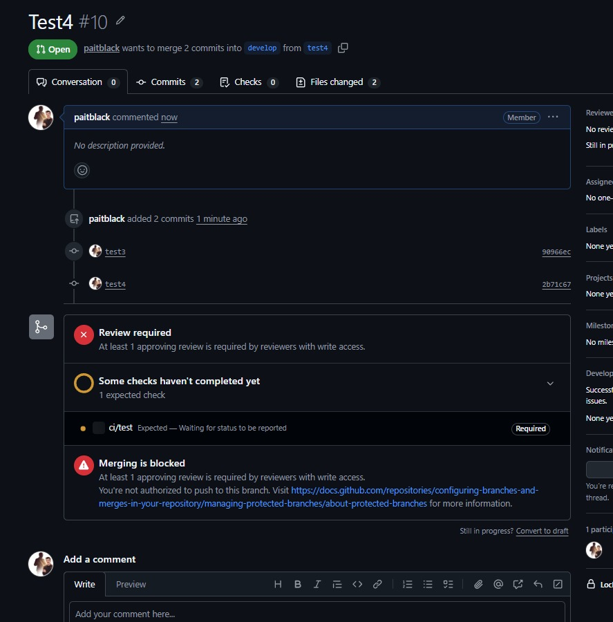

- [x] **Review required** — *"At least 1 approving review is required by reviewers with
      write access."* `required_reviews: 1` canlıda zorlanıyor.
- [x] **Merging is blocked** — merge düğmesi kapalı; kullanıcı kendi PR'ını onaylayamıyor.
- [x] Kullanıcı adının yanındaki **`Member`** rozeti org rolünün `member` olduğunu
      doğruluyor — `github_membership` kaynağı yerleşmiş.
- [x] PR açma yetkisi korunmuş: developer engellenmiyor, **doğru kanala yönlendiriliyor.**

**Ayrıca görünen — `ci/test` blokajı:** *"ci/test · Expected — Waiting for status to be
reported"* satırı `Required` etiketiyle duruyor. Bu check hiçbir repoda üretilmiyor
(`templates/` henüz dağıtılmıyor), dolayısıyla **onay alınsa bile bu PR merge edilemez.**
Mentör admin muafiyetiyle geçtiği için bugüne kadar fark edilmedi; ilk kez normal developer
akışında görünür oldu. Kalıcı çözüm şablon dağıtımıdır — [`ROADMAP.md`](../ROADMAP.md) Faz 2.

### 6.5 Henüz doğrulanmayanlar

- [ ] `main`'de code owner (mentör) onayının zorunlu kılınması — 6.3/6.4 testleri
      `develop` üzerinde yapıldı, `main` akışı ayrıca denenmeli
- [ ] CI workflow tetiklenmesi ve `ci/test` status check'inin **raporlanması**
      _(zorunlu olduğu doğrulandı, üretildiği doğrulanmadı — bkz. 6.4)_
- [ ] Force push denemesinin sonucu (admin bypass'ının force push'u kapsayıp kapsamadığı
      bilinmiyor)

Takip: [`TODO.md`](../TODO.md)

> **Not:** Modül CODEOWNERS dosyasını repo'ya yazıyor ancak workflow dosyalarını
> dağıtmıyor. Workflow dağıtımının repo bazında konfigüre edilebilir hale getirilmesi
> kararlaştırıldı; ayrıntı `TODO.md` içinde.

---

## 7. GitOps Döngüsü — Uçtan Uca Doğrulama

**Tarih:** 2026-08-16 · **PR:** `feat/gitops-templates` → `develop` · **Repo:** `Tidyorg`

`terraform-plan.yml` yazıldığından beri **bir kez bile çalışmamıştı** — dosya YAML olarak
geçersizdi (bkz. 7.2). Düzeltildikten sonra açılan ilk PR, döngünün ilk gerçek testi oldu.

### 7.1 Plan workflow'u tetiklendi ve yorum düştü — ✅

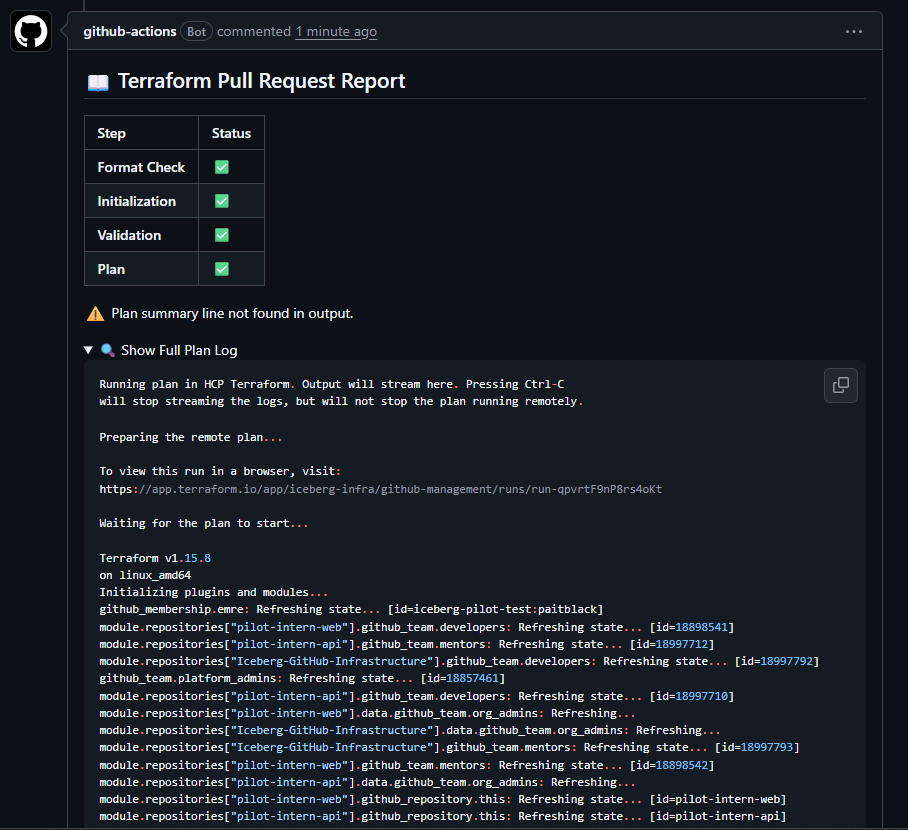

- [x] `pull_request` tetikleyicisi çalıştı — `paths` filtresi `terraform/**` ile eşleşti
- [x] Dört adım da geçti: **Format Check ✅ · Initialization ✅ · Validation ✅ · Plan ✅**
- [x] Plan **HCP Terraform'da uzaktan** koştu, çıktısı PR'a yorum olarak yazıldı
- [x] `Terraform Plan (pull_request) — Successful in 45s`

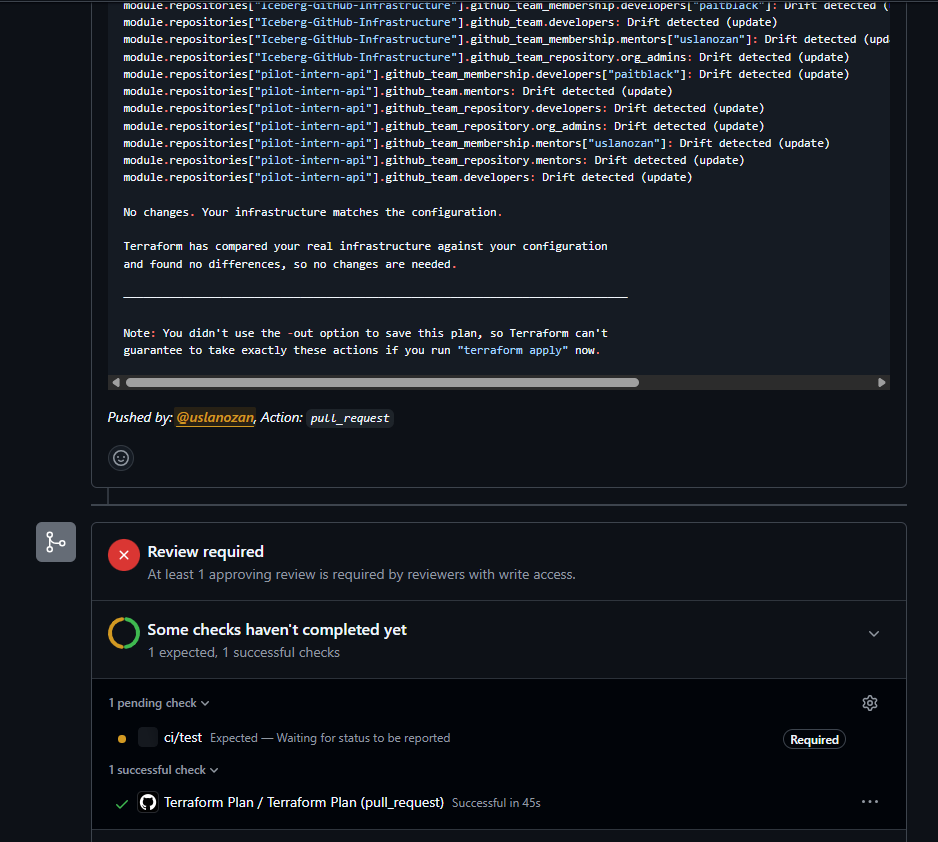

- [x] `No changes. Your infrastructure matches the configuration.` — elle yapılan apply ile
      kod birebir uyumlu
- [x] `Review required` kırmızı, `ci/test` **Expected — Waiting for status to be reported**
- [x] Alt bilgi doğru: `Pushed by: @uslanozan, Action: pull_request`

### 7.2 Bulunan iki kusur

Bölüm 4'teki iki kusur modülde bulunmuştu; bu ikisi GitOps katmanında çıktı.

**a) `terraform-plan.yml` geçersiz YAML'dı — dosya hiç çalışmamıştı**

91–109. satırlar `script: |` blok skalerinin dışına, sütun 0'a düşmüştü; YAML ayrıştırıcı
markdown tablosunun `| Step | Status |` satırını üst düzey anahtar sanıyordu.

**Kök sebep düşünüldüğünden ilginç:** satırları yalnızca içeri almak da çözmüyor — JS
template literal'in içindeki 12 boşluk string'e dahil olup markdown tablosunu kod bloğuna
çeviriyor. İki gereksinim çakışıyordu (YAML girinti ister, markdown istemez). Dosyayı yazan
kişi muhtemelen bu yüzden sola yaslamış. Çözüm: satır dizisi + `join('\n')`.

**Öğrenilen:** `tasks-ozan.md`'de Faz 3 "tamamlandı" işaretliydi. Bir workflow'un
**yazılmış olması çalıştığı anlamına gelmiyor** — Bölüm 6'yı bilerek "doğrulanmadı"
bırakma disiplininin kod tarafında uygulanmamış hâli.

**b) Temiz plan "özet bulunamadı" uyarısı veriyordu**

Yukarıdaki ekran görüntüsünde görünüyor: `⚠️ Plan summary line not found in output.`

Sebep: özet regex'i yalnızca `Plan: X to add, Y to change, Z to destroy` satırını arıyordu.
**Terraform o satırı değişiklik yokken hiç yazmıyor** — sadece `No changes.` diyor. Yani
sistem en sağlıklı olduğu anda uyarı üretiyordu; birkaç hafta sonra biri buna bakıp
"bir şey bozuldu" diye düşünecekti.

Düzeltme: `No changes` için ayrı bir dal eklendi. Ayrıca `Drift detected` satırları
sayılıp özete not olarak konuldu — log'daki duvarın kozmetik olduğunu açıklıyor
(bkz. 7.3). Her iki senaryo da sahte plan çıktılarıyla render edilerek doğrulandı.

### 7.3 Drift gürültüsü — beklenen davranış

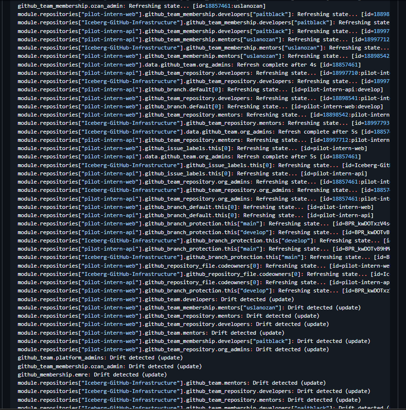

Her `plan` çıktısında onlarca `Drift detected (update)` satırı çıkıyor ve hiçbiri gerçek
değişiklik üretmiyor. Sebep: GitHub API bazı alanları provider'ın gönderdiğinden farklı
formatta geri döndürüyor (ör. takım açıklamasında boşluk normalleşmesi). Provider bunu
kayıt sayıyor, apply sırasında fark görmeyince geçiyor.

Tehlikesiz ama **gerçek değişiklikleri gölgeliyor** — bu yüzden özete sayı olarak eklendi.

### 7.4 Kanıtlanan bir tasarım kararı — `develop`'a merge hiçbir şey uygulamaz

`terraform-apply.yml` yalnızca `main`'e push'ta tetikleniyor. Bu PR `develop`'a açıldığı
için **merge sonrası hiçbir apply çalışmadı** — beklenen davranış, çünkü değişiklikler
zaten elle apply edilmişti.

Ama bu tam olarak `develop`'un ürettiği sorunun canlı hâli: **kod merge görünüyor, canlıda
karşılığı yok.** Kontrol düzlemi repolarının trunk-based çalışması kararının
([`ROADMAP.md`](../ROADMAP.md) Karar F) dayandığı gözlem budur.

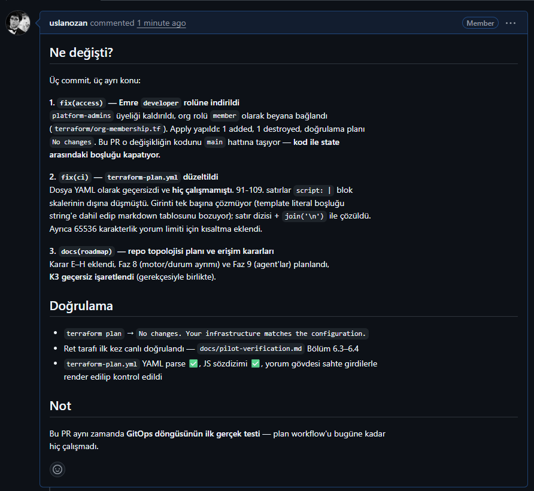

### 7.5 Yan tespit — PR şablonu gelmedi

PR açarken açıklama alanı **boş geldi.** `templates/.github/PULL_REQUEST_TEMPLATE.md`
yazılmış durumda ama hiçbir repo'ya dağıtılmıyor; GitHub şablonu repo'nun **kendi**
`.github/` klasöründen okur ve orada yalnızca `workflows/` var.

[`docs/onboarding.md`](onboarding.md)'deki *"PR şablonu otomatik dolar"* iddiasının neden
hâlâ yanlış olduğunun doğrudan kanıtı. Faz 2 (şablon dağıtımı) bunu kapatacak.

---

## 8. Doğrulamayı Tekrarlamak

```powershell
terraform -chdir=terraform plan
```

Beklenen çıktı:

```
No changes. Your infrastructure matches the configuration.
```

Bundan farklı bir çıktı, ya birinin GitHub arayüzünden elle değişiklik yaptığını
ya da modülde yerleşmeyen bir ayar kaldığını gösterir. İkisi de incelenmelidir.
