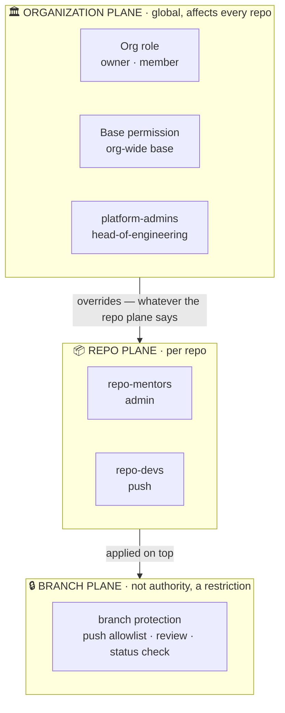
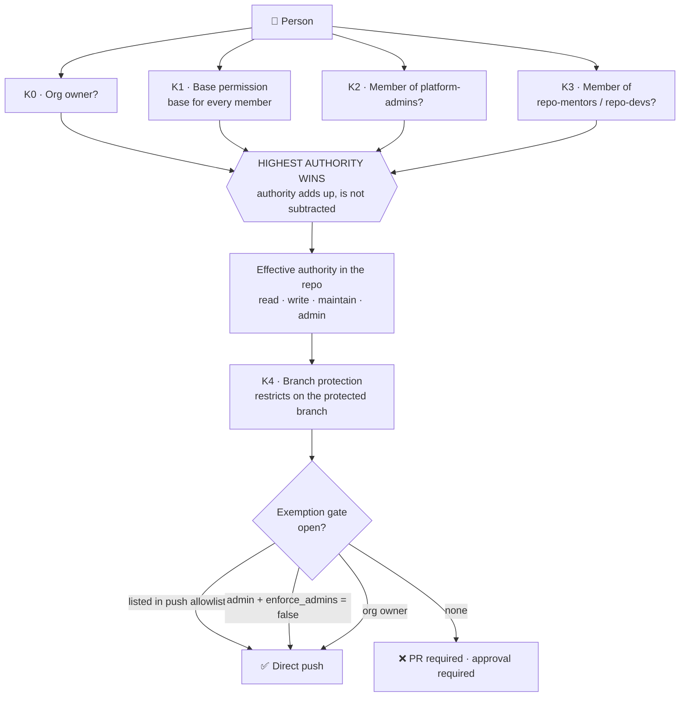
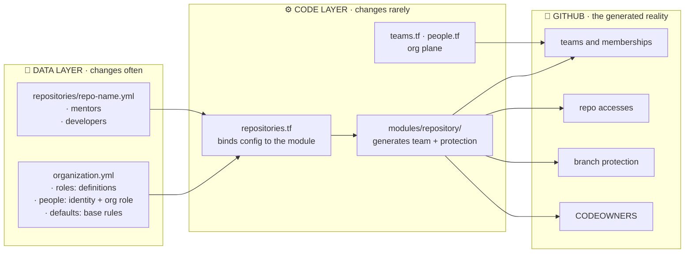
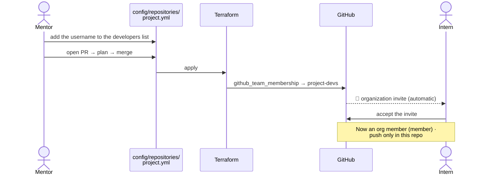

# Organizational Hierarchy and Authorization Model (RBAC)

> **Status:** Rewritten from scratch on 2026-08-15. The previous version described nine teams
> that no longer exist (`core-engineering`, `tech-leads`, `interns-2026`, `backend-team`…) and
> manual onboarding via `team-memberships.tf`. That structure was removed by
> [`ACCESS-MODEL.md`](../ACCESS-MODEL.md) Decision 12; this document describes the model in
> force.

Authorization is never granted from the GitHub interface. All assignments live in YAML files
under `terraform/config/`, and Terraform applies them to GitHub.

---

## 1. Terms first — the word "role" describes five different things

This is the source of the confusion. All five live in different layers:

| # | What | Where it lives | Grants authority? |
| :--- | :--- | :--- | :--- |
| 1 | **Role definition** — "what does developer mean?" | `organization.yml` → `roles:` | ❌ Meaning only. Not assigned to anyone. |
| 2 | **Org role** — owner or member? | GitHub org setting ← `people.org_role` | ✅ **Owner overrides everything** |
| 3 | **Org-wide role** — head-of-engineering | `platform-admins` team | ✅ Admin on every repo |
| 4 | **Repo role** — mentor / developer | `<repo>-mentors` / `<repo>-devs` teams ← `config/repositories/*.yml` | ✅ Only in that repo |
| 5 | **Role label** — backend, frontend, devops | *Does not exist today* | ❌ **Must never grant authority** |

The two most often confused are **1 and 4**: the `roles:` block is a dictionary, not a list of
people. It says "developer = push"; *who* is a developer is stated by the repo files.

There is also a non-human actor: the **`tidyorg-infra-bot`** GitHub App. It is Terraform's
identity, not a role. It performs the write operations to the repos
(see [`integrations/github-app/README.md`](../integrations/github-app/README.md)).

### Why label teams must not grant authority

If discipline teams like `backend-team` come back one day, they must come back **as labels
only**, carrying no repo authority. The reason is the "highest wins" rule below: if a person is
a member of both `<repo>-devs` (push) and `backend-team` (write, by mistake), GitHub applies
the higher one and the least-privilege principle is silently breached. Detail:
[`teams.tf`](../terraform/teams.tf) comment.

---

## 2. Two planes — and one overrides the other

**The repo file cannot answer the org plane.** The answer to "is this person an org owner?" is
not in `config/repositories/*.yml` — and if they are an owner, every line in there is void.

---

## 3. How effective authority is computed

Two rules explain everything:

**Authority adds up, is not subtracted.** Effective authority is the *maximum* of all paths.
Removing someone from a team reduces nothing if another path is open.

**Branch protection is not an authority but a restriction** — and there are **three separate
exemption gates**. Closing one is not enough.

> **Live proof of this model (2026-08-15):** A person written as `developer` in
> `config/repositories/*.yml` was admin on every repo because they were a member of
> `platform-admins`, was exempt via the second gate thanks to `enforce_admins = false`, and
> via the third gate thanks to `head-of-engineering` in `push_allowed_roles`. They pushed
> directly to `develop`. The rule was correct — **it just wasn't visible to whom the rule
> applied.** After the team membership was removed, the same push was rejected with
> `GH006: Protected branch update failed`, and the PR was blocked with "Review required." The
> model works.

---

## 4. The authorization matrix in force

| Role | Scope | Repo authority | Push to protected branch | Opens PR | Approves PR | Merge without approval |
| :--- | :--- | :--- | :--- | :--- | :--- | :--- |
| **head-of-engineering** | Organization | admin (every repo) | ✅ in allowlist | ✅ | ✅ | ✅ while `enforce_admins=false` |
| **mentor** | Assigned repo | admin | ✅ in allowlist | ✅ | ✅ | ✅ while `enforce_admins=false` |
| **developer** | Assigned repo | push | ❌ | ✅ | ✅ | ❌ |
| **org owner** | Organization | admin (every repo) | ✅ | ✅ | ✅ | ✅ *(cannot be turned off)* |
| `tidyorg-infra-bot` | Organization | admin | ⚠️ see Section 8 | — | — | — |

Role definitions: [`organization.yml`](../terraform/config/organization.yml) → `roles:`.
Branch rules: same file → `defaults.protected_branches`.

### 4.1 Repo creation authority — the thing GitHub cannot say _(2026-08-18)_

`members_can_create_repositories = false` was set: now **only an org owner** can create a repo
by hand. The normal path goes through config — `config/repositories/<name>.yml` is added, a PR
is opened, and apply creates the repo.

**"Let only mentors create them" cannot be expressed in GitHub.** At the org level, repo
creation authority is binary: either all members, or only owners. There is no team-based
intermediate tier.

- [Restricting repository creation in your organization](https://docs.github.com/en/organizations/managing-organization-settings/restricting-repository-creation-in-your-organization)
- [Roles in an organization](https://docs.github.com/en/organizations/managing-peoples-access-to-your-organization-with-roles/roles-in-an-organization)

> 🚨 **"Then we'll make the mentor an owner" — the cost is not small.**
>
> Org ownership does not grant repo creation authority; it grants full authority over
> **everything in the organization**: admin on every repo, exempt on every protected branch
> (with `enforce_admins = false` by Decision E), adding/removing members, changing org
> settings, deleting repos, access to billing.
>
> This is why the org owner row in the matrix above says **"cannot be turned off."** The root
> of the 2026-08-15 incident was exactly this.
>
> So making someone an owner just so they can create repos is **knocking down the wall to open
> a door.** Ownership should be granted out of an **org management** need, not a repo creation
> need; its count is kept deliberately low ([`../ACCESS-MODEL.md`](../ACCESS-MODEL.md): at most
> around 3). Who is an owner shows up in the `terraform output branch_protection_bypass` output.
>
> The right answer for the repo creation need is not ownership, but **creating from config** —
> which is the intended flow anyway.

### Decision: `enforce_admins` stays `false` on every branch _(confirmed 2026-08-15)_

Setting it to `true` for `main` was discussed and **rejected.** Rationale: mentors and above
must always be able to make fast decisions; if a protected branch is producing a blockage, the
path to intervene must stay open. This is a deliberate trade-off, not a forgotten setting.

Its consequences — the three must be read together:

- **The developer side is fully protected.** What stops them is not admin exemption, but that
  they are not listed in the push allowlist and the approval requirement. That both work was
  proven on 2026-08-15.
- **Mentor and head-of-engineering are permanently exempt.** Who holds these roles is now not a
  technical matter but a **human-resources discipline** matter. If it stops at the wrong
  person, there is no second mechanism to stop them — that is precisely the lesson of the
  2026-08-15 incident.
- **The scope of the exemption is broader than assumed: force push and branch deletion are
  included too.** It was tested live and the result split by role:

  | Role | `git push --force` to a protected branch |
  | :--- | :--- |
  | `developer` | ❌ Rejected — `allow_force_push: false` is enforced |
  | `mentor` · `head-of-engineering` | ✅ Passes |

  The same applies to `allow_deletions: false` — a mentor can delete a protected branch
  (`develop` was deleted this way on 2026-08-17). So `enforce_admins = false` means not
  "skipping the PR and approval rules" but **exemption from the whole of branch protection.**
  Its operational consequences: [`runbook.md`](runbook.md) Section 3.6.
- **Terraform's own write operations are safe.** The App can write CODEOWNERS to the default
  branch with admin exemption. Had `true` been chosen, the App would have had to be added to
  `push_allowances`, otherwise the GitOps loop would lock itself out.

This decision makes it **all the more** important that the answer to "who can bypass right
now?" be visible; when there is a permanent exemption, the only control is visibility.

---

## 5. What is defined where

The rule: the answer to **who** must always be in the data layer. The moment an assignment is
written into a `.tf` file, the config starts to lie — that was the root of the 2026-08-15
incident.

---

## 6. Scenario — a new intern arrives

**Short answer:** No need to add them to the org by hand. Writing them into the repo file is
enough; the invite goes automatically. But the person **becomes an org member** — this is
unavoidable, team-based access does not work without org membership.

Steps:

1. Add the GitHub username to the `developers:` list in
   [`config/repositories/<repo>.yml`](../terraform/config/repositories/).
2. Open a PR, read the plan, merge. Apply runs.
3. The organization invite goes to the person **automatically** — adding to a team produces an
   invite in GitHub.
4. On accepting, they become an org `member` and get `push` authority **only in that repo**.

**Why can't they access other repos?** Org membership alone grants no access to any repo — *as
long as the base permission is `None`*. If this setting is `read` or `write`, every member gets
that authority on every repo and the whole model is breached from the base. See Section 8.

**Is access possible without ever joining the org?** Only as an *outside collaborator* — a type
of access without a team, bound directly to the repo. It is the right tool for genuine external
consultants, but this model does not cover it today (the `consultant` role sits as future work
in [`organization.example.yml`](../terraform/config/organization.example.yml)). An intern is
one of the team; becoming an org member is the correct behavior.

**If the intern later becomes a mentor:** it is enough to move their name from `developers` to
`mentors` in the repo file. Team memberships swap themselves on apply.

---

## 7. Leaving (offboarding)

The full list is in [`runbook.md`](runbook.md) §1.4. The critical order from an authorization
standpoint:

1. **Cut the org plane first.** As long as `platform-admins` membership and org ownership
   remain, what the repo plane says does not matter at all.
2. Remove them from the `mentors` / `developers` lists in the repo files.
3. Delete the `people` record.
4. PR → merge → apply.

> ⚠️ If you remove them from the interface but do not update the config, **the next apply adds
> the person back.** In an emergency, cut from the UI first, then fix the config immediately
> afterward.

---

## 8. Known gaps

| Gap | Impact | Follow-up |
| :--- | :--- | :--- |
| The `people` section is not read by Terraform | The org plane is partly undeclared; `org-membership.tf` is a single-person exception file | Week 6 |
| `default_repository_permission` = **`Read`**, and moreover unmanaged | Every org member **can read every repo**. There is no write hole, but no isolation either: a new intern sees all repos from day one. Evidence: [`04-collaborators-teams.png`](images/pilot-verification/04-collaborators-teams.png) → *Base role: Read*. A decision is needed: should it be `None`? | Week 6 |
| `ci/test` is not reported on any repo | The required check has no counterpart. Someone in the `developer` role cannot merge even if their PR is approved; because the mentor passes with admin exemption, it does not show up in day-to-day flow | Phase 2 · *not touched for now (2026-08-15)* |
| `enforce_admins = false` | Mentor and head-of-engineering skip all branch rules | **Accepted trade-off** — the decision in Section 4 |
| "Who can bypass?" is not listed anywhere | With a permanent exemption in place, the only control is visibility; today who holds the role can only be understood by reading the `.tf` | Awaiting decision |

---

## Related documents

- [`ACCESS-MODEL.md`](../ACCESS-MODEL.md) — the **why** of the model and the decisions made
- [`config-guide.md`](config-guide.md) — who changes the config and how
- [`runbook.md`](runbook.md) — operational scenarios
- [`onboarding.md`](onboarding.md) — a newcomer's first day
