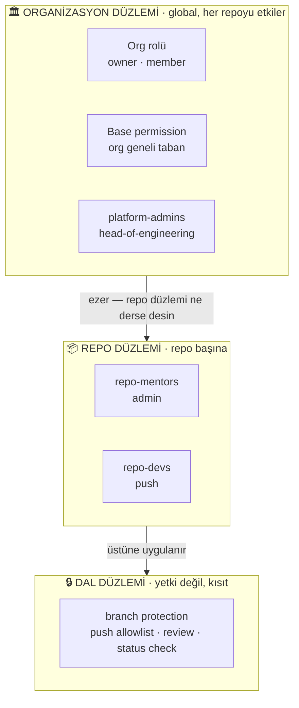
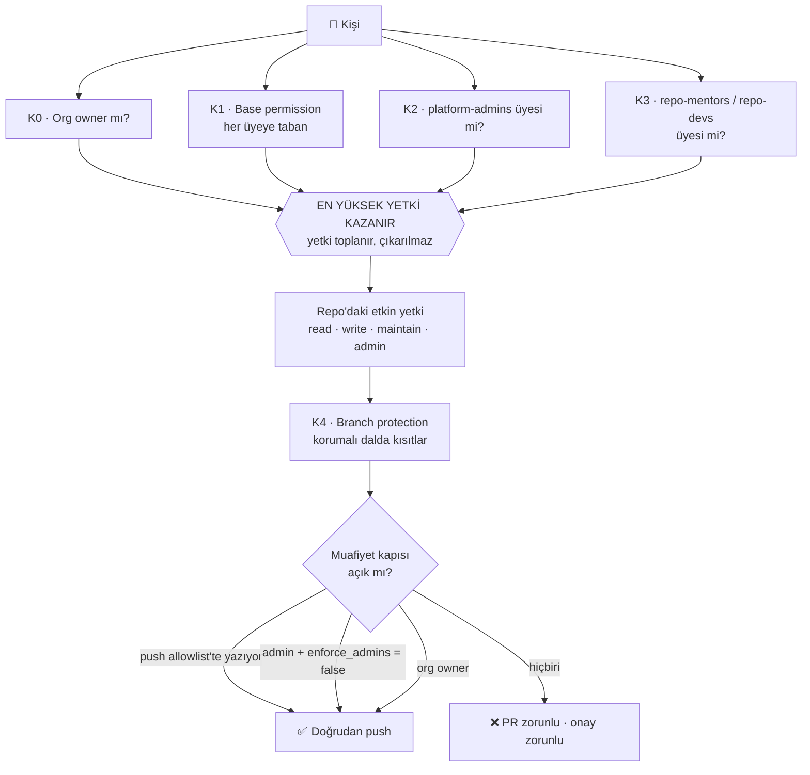
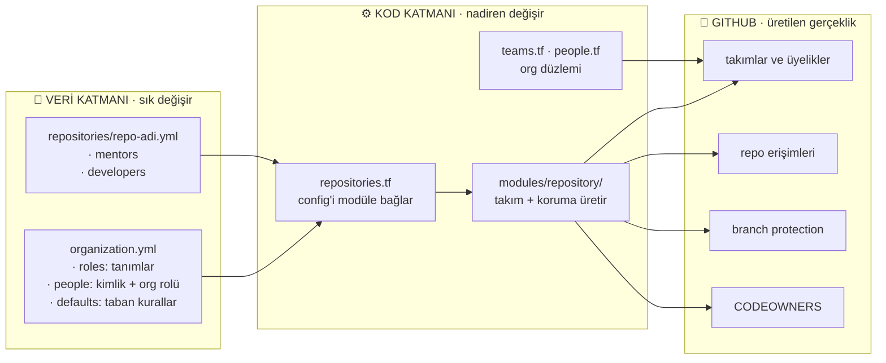
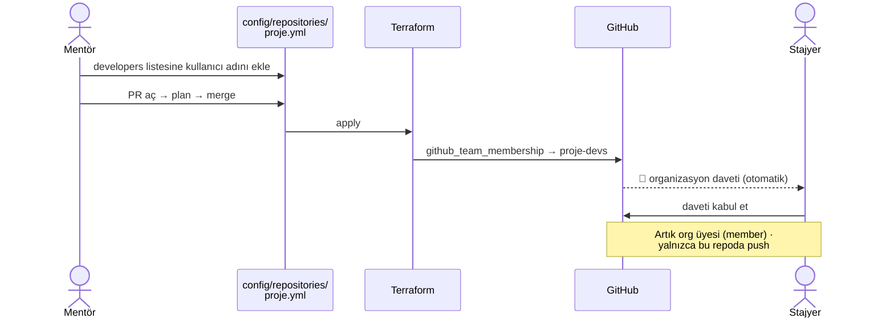

# Organizasyonel Hiyerarşi ve Yetki Modeli (RBAC)

> **Durum:** 2026-08-15'te baştan yazıldı. Önceki sürüm artık var olmayan dokuz takımı
> (`core-engineering`, `tech-leads`, `interns-2026`, `backend-team`…) ve `team-memberships.tf`
> üzerinden elle onboarding'i anlatıyordu. O yapı [`ACCESS-MODEL.md`](../ACCESS-MODEL.md)
> Karar 12 ile kaldırıldı; bu doküman yürürlükteki modeli anlatır.

Yetki hiçbir zaman GitHub arayüzünden verilmez. Tüm atamalar `terraform/config/` altındaki
YAML dosyalarında yaşar, Terraform onları GitHub'a uygular.

---

## 1. Önce terimler — "rol" kelimesi beş farklı şeyi anlatıyor

Karışıklığın kaynağı bu. Beşi de farklı katmanda yaşar:

| # | Ne | Nerede yaşar | Yetki verir mi |
| :--- | :--- | :--- | :--- |
| 1 | **Rol tanımı** — "developer ne demek?" | `organization.yml` → `roles:` | ❌ Sadece anlam. Kimseye atanmaz. |
| 2 | **Org rolü** — owner mı, member mı? | GitHub org ayarı ← `people.org_role` | ✅ **Owner her şeyi ezer** |
| 3 | **Org kapsamlı rol** — head-of-engineering | `platform-admins` takımı | ✅ Her repoda admin |
| 4 | **Repo rolü** — mentor / developer | `<repo>-mentors` / `<repo>-devs` takımları ← `config/repositories/*.yml` | ✅ Yalnızca o repoda |
| 5 | **Rol etiketi** — backend, frontend, devops | *Bugün yok* | ❌ **Asla yetki vermemeli** |

En sık karıştırılan ikisi **1 ve 4**: `roles:` bloğu bir sözlüktür, kişi listesi değil.
"developer = push" der; *kimin* developer olduğunu repo dosyaları söyler.

Bir de insan olmayan bir aktör var: **`tidyorg-infra-bot`** GitHub App'i. Terraform'un
kimliğidir, bir rol değildir. Repo'lara yazma işlemlerini o yapar
(bkz. [`integrations/github-app/README.md`](../integrations/github-app/README.md)).

### Neden etiket takımları yetki vermemeli

`backend-team` gibi disiplin takımları bir gün geri gelirse **yalnızca etiket** olarak
gelmeli, repo yetkisi taşımadan. Sebep aşağıdaki "en yüksek kazanır" kuralı: kişi hem
`<repo>-devs` (push) hem `backend-team` (yanlışlıkla write) üyesiyse GitHub yükseği uygular
ve en az yetki ilkesi sessizce delinir. Ayrıntı: [`teams.tf`](../terraform/teams.tf) yorumu.

---

## 2. İki düzlem — ve biri diğerini eziyor

**Repo dosyası org düzlemini cevaplayamaz.** "Bu kişi org owner mı?" sorusunun cevabı
`config/repositories/*.yml` içinde yoktur — ve owner ise oradaki her satır hükümsüzdür.

---

## 3. Etkin yetki nasıl hesaplanır

İki kural her şeyi açıklar:

**Yetki toplanır, çıkarılmaz.** Etkin yetki tüm yolların *maksimumudur*. Bir takımdan
çıkarmak, başka bir yol açıksa hiçbir şeyi azaltmaz.

**Branch protection bir yetki değil, kısıttır** — ve **üç ayrı muafiyet kapısı** vardır.
Birini kapatmak yetmez.

> **Bu modelin canlı ispatı (2026-08-15):** Bir kişi `config/repositories/*.yml` içinde
> `developer` yazılıyken `platform-admins` üyesi olduğu için her repoda admin'di,
> `enforce_admins = false` sayesinde ikinci kapıdan, `push_allowed_roles` içindeki
> `head-of-engineering` sayesinde üçüncü kapıdan muaftı. `develop`'a doğrudan push attı.
> Kural doğruydu — **kuralın kime uygulandığı görünmüyordu.**
> Takım üyeliği kaldırıldıktan sonra aynı push `GH006: Protected branch update failed`
> ile reddedildi, PR "Review required" ile bloklandı. Model çalışıyor.

---

## 4. Yürürlükteki yetki matrisi

| Rol | Kapsam | Repo yetkisi | Korumalı dala push | PR açar | PR onaylar | Onaysız merge |
| :--- | :--- | :--- | :--- | :--- | :--- | :--- |
| **head-of-engineering** | Organizasyon | admin (her repo) | ✅ allowlist'te | ✅ | ✅ | ✅ `enforce_admins=false` iken |
| **mentor** | Atandığı repo | admin | ✅ allowlist'te | ✅ | ✅ | ✅ `enforce_admins=false` iken |
| **developer** | Atandığı repo | push | ❌ | ✅ | ✅ | ❌ |
| **org owner** | Organizasyon | admin (her repo) | ✅ | ✅ | ✅ | ✅ *(kapatılamaz)* |
| `tidyorg-infra-bot` | Organizasyon | admin | ⚠️ bkz. Bölüm 8 | — | — | — |

Rol tanımları: [`organization.yml`](../terraform/config/organization.yml) → `roles:`.
Dal kuralları: aynı dosya → `defaults.protected_branches`.

### 4.1 Repo açma yetkisi — GitHub'ın diyemediği şey _(2026-08-18)_

`members_can_create_repositories = false` yapıldı: artık **yalnızca org owner** elle repo
açabilir. Normal yol config'den geçer — `config/repositories/<ad>.yml` eklenir, PR açılır,
apply repo'yu yaratır.

**"Sadece mentörler açabilsin" GitHub'da ifade edilemiyor.** Org düzeyinde repo açma
yetkisi ikili: ya tüm üyeler, ya yalnızca owner'lar. Takım bazlı ara kademe yoktur.

- [Restricting repository creation in your organization](https://docs.github.com/en/organizations/managing-organization-settings/restricting-repository-creation-in-your-organization)
- [Roles in an organization](https://docs.github.com/en/organizations/managing-peoples-access-to-your-organization-with-roles/roles-in-an-organization)

> 🚨 **"O zaman mentörü owner yaparız" — bedeli küçük değil.**
>
> Org owner'lık repo açma yetkisi vermez; **organizasyondaki her şeye** tam yetki verir:
> her repo'da admin, her korumalı dalda muaf (Karar E ile `enforce_admins = false`),
> üye ekleme/çıkarma, org ayarlarını değiştirme, repo silme, faturaya erişim.
>
> Yukarıdaki matriste org owner satırının **"kapatılamaz"** demesinin sebebi bu.
> 2026-08-15 olayının kökü de tam olarak buydu.
>
> Yani repo açabilsin diye owner yapmak, **bir kapıyı açmak için duvarı yıkmaktır.**
> Owner'lık repo açma ihtiyacından değil, **org yönetimi** ihtiyacından verilmelidir;
> sayısı bilinçli tutulur ([`../ACCESS-MODEL.md`](../ACCESS-MODEL.md): azami 3 civarı).
> Kimin owner olduğu `terraform output branch_protection_bypass` çıktısında görünür.
>
> Repo açma ihtiyacı için doğru cevap owner'lık değil, **config'den açmaktır** — zaten
> istenen akış odur.

### Karar: `enforce_admins` her dalda `false` kalır _(2026-08-15 teyit edildi)_

`main` için `true` yapmak tartışıldı ve **reddedildi.** Gerekçe: mentörler ve üstü her
zaman hızlı karar alabilmeli; korumalı dal bir tıkanıklık üretiyorsa müdahale yolu açık
kalmalı. Bu bilinçli bir tavizdir, unutulmuş bir ayar değil.

Sonuçları — üçü birlikte okunmalı:

- **Developer tarafı tam korunur.** Onları durduran şey admin muafiyeti değil, push
  allowlist'inde yazmamaları ve onay zorunluluğu. İkisinin de çalıştığı 2026-08-15'te
  kanıtlandı.
- **Mentör ve head-of-engineering kalıcı olarak muaftır.** Bu rollerde kimin bulunduğu
  artık teknik değil, **insan kaynağı disiplini** meselesidir. Yanlış kişide durması
  hâlinde onu durduracak ikinci bir mekanizma yoktur — 2026-08-15 olayının dersi tam
  olarak budur.
- **Muafiyetin kapsamı sanılandan geniş: force push ve dal silme de dahil.** Canlı test
  edildi ve sonuç role göre ayrıştı:

  | Rol | `git push --force` korumalı dala |
  | :--- | :--- |
  | `developer` | ❌ Reddedilir — `allow_force_push: false` zorlanıyor |
  | `mentor` · `head-of-engineering` | ✅ Geçer |

  Aynı şey `allow_deletions: false` için de geçerli — mentör korumalı bir dalı silebilir
  (2026-08-17'de `develop` böyle silindi). Yani `enforce_admins = false`, "PR ve onay
  kurallarını atlama" değil, **dal korumasının tamamından muafiyet** anlamına geliyor.
  Operasyonel sonuçları: [`runbook.md`](runbook.md) Bölüm 3.6.
- **Terraform'un kendi yazma işlemleri güvendedir.** App, CODEOWNERS'ı default branch'e
  admin muafiyetiyle yazabiliyor. `true` seçilseydi App'in `push_allowances`'a eklenmesi
  gerekirdi, aksi halde GitOps döngüsü kendi kendini kilitlerdi.

Bu karar, "kim şu an bypass edebiliyor?" sorusunun görünür olmasını **daha da**
önemli hale getirir; kalıcı muafiyet varsa tek kontrol görünürlüktür.

---

## 5. Ne nerede tanımlı

Kural: **kim** sorusunun cevabı daima veri katmanında olmalı. Bir atama `.tf` içine
yazıldığı anda config yalan söylemeye başlar — 2026-08-15 olayının kökü buydu.

---

## 6. Senaryo — yeni bir stajyer geliyor

**Kısa cevap:** Org'a elle eklemeye gerek yok. Repo dosyasına yazmak yeterli; davet
otomatik gider. Ama kişi **org üyesi olur** — bu kaçınılmazdır, takım tabanlı erişim
org üyeliği olmadan çalışmaz.

Adımlar:

1. [`config/repositories/<repo>.yml`](../terraform/config/repositories/) içindeki
   `developers:` listesine GitHub kullanıcı adını ekle.
2. PR aç, plan'ı oku, merge et. Apply çalışır.
3. Kişiye organizasyon daveti **otomatik** gider — takıma ekleme GitHub'da davet üretir.
4. Kabul edince org `member` olur ve **yalnızca o repoda** `push` yetkisi alır.

**Neden diğer repo'lara erişemez?** Org üyeliği tek başına hiçbir repoya erişim vermez —
*base permission `None` olduğu sürece*. Bu ayar `read` veya `write` ise her üye her repoda
o yetkiyi alır ve bu modelin tamamı tabandan delinir. Bölüm 8'e bakın.

**Org'a hiç girmeden erişim mümkün mü?** Sadece *outside collaborator* olarak — takımsız,
repo'ya doğrudan bağlı bir erişim türü. Gerçek dış danışmanlar için doğru araçtır ama bu
model bugün onu kapsamıyor (`consultant` rolü
[`organization.example.yml`](../terraform/config/organization.example.yml) içinde future
work olarak duruyor). Stajyer ekipten biridir; org üyesi olması doğru davranıştır.

**Stajyer daha sonra mentör olursa:** repo dosyasında adını `developers`'tan `mentors`'a
taşımak yeterli. Takım üyelikleri apply'da kendiliğinden yer değiştirir.

---

## 7. Ayrılma (offboarding)

Tam liste [`runbook.md`](runbook.md) §1.4'te. Yetki açısından kritik sıra:

1. **Org düzlemini önce kes.** `platform-admins` üyeliği ve org owner'lığı durduğu sürece
   repo düzleminde ne yazdığının hiçbir önemi yok.
2. Repo dosyalarındaki `mentors` / `developers` listelerinden çıkar.
3. `people` kaydını sil.
4. PR → merge → apply.

> ⚠️ Arayüzden çıkarıp config'i güncellemezseniz **bir sonraki apply kişiyi geri ekler.**
> Acil durumda önce UI'dan kesin, hemen ardından config'i düzeltin.

---

## 8. Bilinen açıklar

| Açık | Etkisi | Takip |
| :--- | :--- | :--- |
| `people` bölümü Terraform tarafından okunmuyor | Org düzlemi kısmen beyansız; `org-membership.tf` tek kişilik istisna dosyası | Hafta 6 |
| `default_repository_permission` = **`Read`**, üstelik yönetilmiyor | Her org üyesi **her repo'yu okuyabiliyor**. Yazma deliği yok ama izolasyon da yok: yeni bir stajyer ilk günden tüm repo'ları görür. Kanıt: [`04-collaborators-teams.png`](images/pilot-verification/04-collaborators-teams.png) → *Base role: Read*. Karar gerekiyor: `None` mı olmalı? | Hafta 6 |
| `ci/test` hiçbir repoda raporlanmıyor | Required check karşılıksız. `developer` rolündeki biri PR'ını onaylatsa bile merge edemez; mentör admin muafiyetiyle geçtiği için gündelik akışta görünmüyor | Faz 2 · *şimdilik dokunulmuyor (2026-08-15)* |
| `enforce_admins = false` | Mentör ve head-of-engineering tüm dal kurallarını atlar | **Kabul edilmiş taviz** — Bölüm 4'teki karar |
| "Kim bypass edebiliyor?" hiçbir yerde listelenmiyor | Kalıcı muafiyet varken tek kontrol görünürlük; bugün rolü kimin taşıdığı ancak `.tf` okunarak anlaşılıyor | Karar bekliyor |

---

## İlgili dokümanlar

- [`ACCESS-MODEL.md`](../ACCESS-MODEL.md) — modelin **neden**i ve verilen kararlar
- [`config-guide.md`](config-guide.md) — config'i kim nasıl değiştirir
- [`runbook.md`](runbook.md) — operasyonel senaryolar
- [`onboarding.md`](onboarding.md) — yeni katılanın ilk günü
