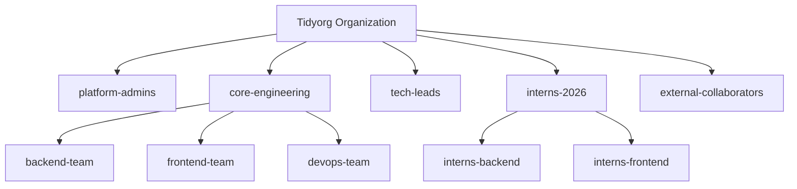

# Organizasyonel Hiyerarşi ve Yetki Matrisi (RBAC)

Tidyorg GitHub organizasyonu, tam denetlenebilirlik (auditability) ve güvenlik sağlamak amacıyla "Infrastructure as Code (IaC)" yaklaşımıyla yönetilir. Hiçbir kullanıcıya GitHub arayüzü üzerinden manuel yetki verilmez; tüm atamalar Terraform üzerinden kodla yapılır.

## 1. Takım Hiyerarşisi

Organizasyonumuzdaki takım yapısı aşağıdaki diyagramda gösterilmiştir:

## 2. Yetki Matrisi

Takımların sahip olduğu varsayılan erişim hakları (Roller) aşağıdaki tabloda özetlenmiştir.

| Takım / Rol | Repo Erişimi | Dal (Branch) Push | PR Açma | PR Onaylama | Merge Yetkisi | Repo Ayarları |
| :--- | :--- | :--- | :--- | :--- | :--- | :--- |
| **Platform Admins** | Admin | ✅ (Tümü) | ✅ | ✅ | ✅ | ✅ |
| **Tech Leads** | Maintain | ❌ (main/develop hariç) | ✅ | ✅ | ✅ | ❌ |
| **Core Engineering** | Write | ❌ (main/develop hariç) | ✅ | ✅ | ✅ (Onay sonrası) | ❌ |
| **Interns (Stajyerler)** | Read / Triage | ❌ (main/develop hariç) | ✅ (Atanan projede) | ❌ | ❌ | ❌ |
| **External** | Read | ❌ | ✅ (Fork ile) | ❌ | ❌ | ❌ |

## 3. Yeni Kişi Ekleme (Onboarding) Süreci

Ekibe yeni bir geliştirici katıldığında yetki tanımlaması şu adımlarla yapılır:
1. `terraform/team-memberships.tf` dosyasına gidilir.
2. İlgili takım için yeni bir `github_team_membership` bloğu oluşturulur.
3. PR açılır ve yetkililerden onay alınır.
4. PR birleştirildiğinde (merge) GitHub Actions otomatik olarak Terraform `apply` komutunu çalıştırır ve kişiye davet gönderilir.

## 4. Yetki Değiştirme Süreci

Bir kullanıcının takımı veya yetkisi değiştiğinde (örneğin bir stajyerin geliştirici statüsüne geçmesi):
* Asla GitHub arayüzünden manuel değişiklik **yapılmamalıdır**.
* Yine `team-memberships.tf` dosyasındaki ilgili satır (örn: `role = "member"`) güncellenerek PR süreci işletilmelidir.

## 5. İşten Ayrılma (Offboarding) Kontrol Listesi

Bir kişi ekipten ayrıldığında güvenliğin sağlanması için aşağıdaki adımlar izlenir:
- [ ] `terraform/team-memberships.tf` dosyasından kullanıcının üyeliği silinir.
- [ ] Bu değişiklik PR olarak açılıp hemen merge edilir (Erişim anında kesilir).
- [ ] Kullanıcının üzerinde kalan açık PR'lar ve Issue'lar diğer takım üyelerine devredilir.
- [ ] (Varsa) Kullanıcıya ait kişisel erişim token'ları (PAT) ilgili sistemlerden iptal edilir.