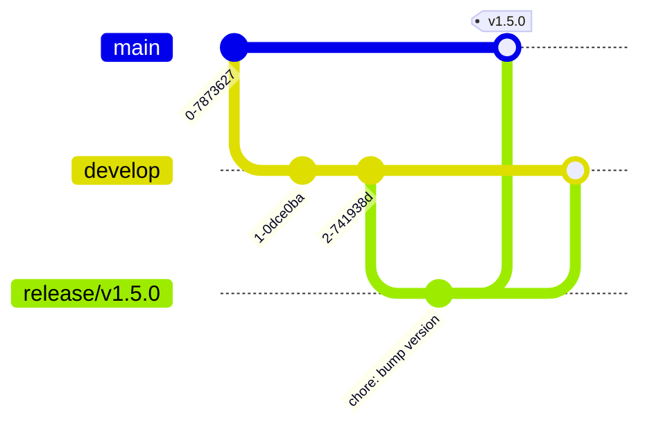

# Release Süreci

Sürüm çıkarmak elle yapılan bir iş değildir. `main` dalına merge edildiği anda
[`release.yml`](../templates/.github/workflows/release.yml) workflow'u devreye girer:
sürüm numarasını commit mesajlarından hesaplar, tag atar ve changelog'lu bir GitHub
Release yayınlar.

Bu doküman o mekanizmanın nasıl çalıştığını ve süreci nasıl yürüteceğini anlatır.

---

## 1. Semantic Versioning

Sürüm numarası `vMAJOR.MINOR.PATCH` biçimindedir.

| Bileşen | Ne zaman artar | Örnek |
| :--- | :--- | :--- |
| **MAJOR** | Geriye dönük uyumluluk kırıldığında | `v1.4.2` → `v2.0.0` |
| **MINOR** | Yeni özellik eklendiğinde (uyumluluk korunur) | `v1.4.2` → `v1.5.0` |
| **PATCH** | Hata düzeltmesi veya performans iyileştirmesi | `v1.4.2` → `v1.4.3` |

"Geriye dönük uyumluluğun kırılması" pratikte şu demektir: bu sürümü kuran biri, kendi
kodunda değişiklik yapmadan çalışmaya devam **edemiyorsa** bu bir MAJOR değişikliktir.
Kaldırılan bir API ucu, değişen bir yanıt formatı, zorunlu hale gelen bir parametre.

---

## 2. Sürüm Numarası Nasıl Hesaplanır

Numarayı kimse elle belirlemez — **commit mesajlarından türetilir.**

| Commit | Etki |
| :--- | :--- |
| `feat(...)!:` veya gövdede `BREAKING CHANGE:` | **MAJOR** |
| `feat(...):` | **MINOR** |
| `fix(...):` veya `perf(...):` | **PATCH** |
| `chore`, `docs`, `refactor`, `test`, `ci` | **Sürüm çıkmaz** |

Workflow, son tag ile `HEAD` arasındaki tüm commit'lere bakar ve **en yüksek** etkiyi
uygular. Yani aralarında bir `feat` ve üç `fix` varsa sonuç MINOR artıştır.

Hiç sürüm gerektiren commit yoksa workflow hiçbir şey yapmadan sonlanır — yalnızca
dokümantasyon değişikliği içeren bir merge yeni sürüm üretmez.

Bu, [`commit-convention.md`](commit-convention.md) kurallarına uymanın somut sebebidir:
commit mesajın sürüm numarasını doğrudan belirler.

---

## 3. Release Dalı ile Sürüm Çıkarma

`develop` yeterli olgunluğa ulaştığında:

**1. Release dalı aç**

```bash
git checkout develop
git pull origin develop
git checkout -b release/v1.5.0
```

**2. Yalnızca sürüm hazırlığı yap.** Bu dalda yeni özellik geliştirilmez:
- Sürüm numarası dosyalarda geçiyorsa güncelle (`package.json`, `version.go` vb.)
- Son testleri çalıştır
- Varsa küçük hata düzeltmeleri

**3. `main`'e PR aç ve merge et.**
`main` koruması gereği 2 onay + mentör onayı gerekir.

**4. Aynı dalı `develop`'a da merge et.**
Release dalında yapılan düzeltmeler `develop`'a dönmezse bir sonraki sürümde kaybolur.

**5. Gerisi otomatik.** `main`'e merge, release workflow'unu tetikler.



---

## 4. Workflow Ne Yapıyor

`main`'e her push'ta sırasıyla:

**1. Geçmişi çeker.** `fetch-depth: 0` ile tüm tag'ler alınır — son sürümü bulmak için
gerekli.

**2. Son tag'i bulur.** `git describe --tags --match 'v*'`. Hiç tag yoksa `v0.0.0`'dan
başlar.

**3. Aradaki commit'leri tarar** ve yukarıdaki tabloya göre artış tipini belirler.

**4. Sürüm gerekmiyorsa durur.** `released=false` çıktısı üretip sonlanır.

**5. Tag atar.**
```
git tag -a v1.5.0 -m "Release v1.5.0"
git push origin v1.5.0
```

**6. GitHub Release yayınlar.** `gh release create --generate-notes` ile changelog
otomatik üretilir; PR başlıkları ve katkıda bulunanlar listelenir.

**7. Docker imajı yayınlar — yalnızca repo'da `Dockerfile` varsa.** İmaj
`ghcr.io/<org>/<repo>:v1.5.0` ve `:latest` etiketleriyle push edilir. Dockerfile yoksa
adım atlanır, hata vermez.

> **Tasarım notu:** Workflow üçüncü parti action kullanmaz; `git` ve `gh` ile yazılmıştır.
> Sebep: bu workflow repo üzerinde yazma yetkisi taşır ve tedarik zinciri riskini en aza
> indirmek istedik.

---

## 5. Elle Sürüm Çıkarma

Otomatik hesaplamayı devre dışı bırakmak gerekirse:

GitHub → Actions → **Release** → **Run workflow** → `bump` alanından `patch`, `minor`
veya `major` seç.

Ne zaman gerekir:
- Commit mesajları standart dışı yazılmış ve otomatik hesap yanlış sonuç veriyor
- Bir MAJOR sürümü bilinçli olarak erken çıkarmak isteniyor
- İlk sürüm (`v1.0.0`) elle işaretlenmek isteniyor

---

## 6. Hotfix Sürümleri

Canlıdaki kritik bir hata için release dalı beklenmez:

```bash
git checkout main
git pull origin main
git checkout -b hotfix/payment-crash
# düzeltme
git commit -m "fix(payment): resolve null pointer in gateway"
```

`main`'e PR açılıp merge edilir → workflow `fix` commit'ini görür → PATCH sürümü çıkar.

**Kritik:** Hotfix dalı `develop`'a da merge edilmelidir, yoksa düzeltme bir sonraki
sürümde geri gelir (regression). Ayrıntı: [`branching-strategy.md`](branching-strategy.md),
Bölüm 7.

---

## 7. Changelog

Ayrı bir `CHANGELOG.md` dosyası tutulmaz. GitHub Release notları otomatik üretilir ve
tek doğruluk kaynağıdır: `https://github.com/<org>/<repo>/releases`.

Notların kalitesi doğrudan **PR başlıklarının** kalitesine bağlıdır — changelog'da
görünen metin PR başlığıdır. "fix stuff" başlıklı bir PR changelog'da da öyle görünür.

---

## 8. Sorun Giderme

**Workflow çalıştı ama release oluşmadı.**
Son tag'den beri sürüm gerektiren commit yoktur. Actions loglarında
`No release-worthy commits since ...` satırını göreceksiniz. Beklenen davranış.

**Yanlış sürüm numarası çıktı.**
Commit mesajları büyük ihtimalle standart dışı. Tag'i silmek yerine bir sonraki sürümde
düzeltin — yayınlanmış bir tag'i geri almak, o sürümü kuranlar için kırılma yaratır.

**Tag atılamadı, izin hatası.**
Workflow'un `permissions: contents: write` iznine ihtiyacı var. `release.yml` içinde
tanımlı; repo ayarlarından Actions yazma izni kısıtlanmışsa açılmalı.

**Docker adımı başarısız.**
`packages: write` izni ve `ghcr.io` erişimi gerekir. Repo'da Dockerfile yoksa adım zaten
atlanır.

---

## 9. İlgili Dokümanlar

- [`commit-convention.md`](commit-convention.md) — Sürümü belirleyen commit formatı
- [`branching-strategy.md`](branching-strategy.md) — Release ve hotfix dal akışı
- [`workflow-guide.md`](workflow-guide.md) — Genel iş akışı
- [`release.yml`](../templates/.github/workflows/release.yml) — Workflow'un kendisi
