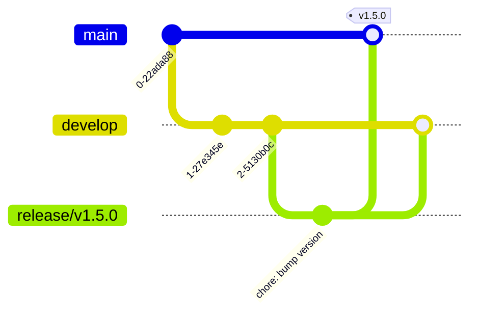

# Release Process

Releasing a version should not be a manual task. The moment it is merged into the `main` branch,
the [`release.yml`](../terraform/templates/.github/workflows/release.yml) workflow kicks in:
it computes the version number from commit messages, creates a tag, and publishes a
GitHub Release with a changelog.

This document explains how that mechanism works and how to carry out the process.

> ## ⚠️ Today this automation is not active in any repo
>
> The `release.yml` template is written and ready to be tested, but
> `config/organization.yml` → `defaults.workflows` is set to **`[ci]`**. So it is not deployed to
> any repo, and a merge to `main` produces no version.
>
> Everything below is written to be valid the moment the workflow is deployed to a repo.
> To activate it, it is enough to set `workflows: [ci, release]` in the relevant repo's config file.
>
> Decision tracking: [`../ROADMAP.md`](../ROADMAP.md) Phase 2.

---

## 1. Semantic Versioning

The version number follows the form `vMAJOR.MINOR.PATCH`.

| Component | When it increases | Example |
| :--- | :--- | :--- |
| **MAJOR** | When backward compatibility is broken | `v1.4.2` → `v2.0.0` |
| **MINOR** | When a new feature is added (compatibility preserved) | `v1.4.2` → `v1.5.0` |
| **PATCH** | A bug fix or performance improvement | `v1.4.2` → `v1.4.3` |

"Breaking backward compatibility" in practice means this: if someone who installs this version
**cannot** keep working without changing their own code, this is a MAJOR change.
A removed API endpoint, a changed response format, a parameter that becomes mandatory.

---

## 2. How the Version Number Is Computed

Nobody sets the number by hand — **it is derived from commit messages.**

| Commit | Impact |
| :--- | :--- |
| `feat(...)!:` or `BREAKING CHANGE:` in the body | **MAJOR** |
| `feat(...):` | **MINOR** |
| `fix(...):` or `perf(...):` | **PATCH** |
| `chore`, `docs`, `refactor`, `test`, `ci` | **No version released** |

The workflow looks at all commits between the last tag and `HEAD` and applies the **highest**
impact. So if there is one `feat` and three `fix` among them, the result is a MINOR increase.

If there is no commit that requires a version, the workflow finishes without doing anything — a
merge that contains only documentation changes produces no new version.

This is the concrete reason to follow the [`commit-convention.md`](commit-convention.md) rules:
your commit message directly determines the version number.

---

## 3. Releasing a Version with a Release Branch

When `develop` reaches sufficient maturity:

**1. Open a release branch**

```bash
git checkout develop
git pull origin develop
git checkout -b release/v1.5.0
```

**2. Do only release preparation.** No new features are developed on this branch:
- If the version number appears in files, update it (`package.json`, `version.go`, etc.)
- Run the final tests
- Small bug fixes, if any

**3. Open a PR to `main` and merge it.**
By `main`'s protection, 2 approvals + mentor approval are required.

**4. Merge the same branch into `develop` as well.**
If fixes made on the release branch do not return to `develop`, they are lost in the next version.

**5. The rest is automatic.** Merging to `main` triggers the release workflow.



---

## 4. What the Workflow Does

On every push to `main`, in order:

**1. Fetches history.** With `fetch-depth: 0` all tags are fetched — needed to find the last
version.

**2. Finds the last tag.** `git describe --tags --match 'v*'`. If there is no tag, it starts from
`v0.0.0`.

**3. Scans the commits in between** and determines the increment type per the table above.

**4. Stops if no version is needed.** It produces the `released=false` output and finishes.

**5. Creates a tag.**
```
git tag -a v1.5.0 -m "Release v1.5.0"
git push origin v1.5.0
```

**6. Publishes a GitHub Release.** With `gh release create --generate-notes` the changelog is
generated automatically; PR titles and contributors are listed.

**7. Publishes a Docker image — only if the repo has a `Dockerfile`.** The image is
pushed with the `ghcr.io/<org>/<repo>:v1.5.0` and `:latest` tags. If there is no Dockerfile, the
step is skipped and does not error.

> **Design note:** The workflow uses no third-party action; it is written with `git` and `gh`.
> The reason: this workflow carries write permission on the repo, and we wanted to minimize
> supply-chain risk.

---

## 5. Releasing a Version Manually

If you need to disable the automatic computation:

GitHub → Actions → **Release** → **Run workflow** → from the `bump` field select `patch`, `minor`,
or `major`.

When it is needed:
- Commit messages were written non-standard and the automatic computation gives the wrong result
- You want to deliberately release a MAJOR version early
- You want to mark the first version (`v1.0.0`) by hand

---

## 6. Hotfix Releases

For a critical bug in production, you don't wait for a release branch:

```bash
git checkout main
git pull origin main
git checkout -b hotfix/payment-crash
# fix
git commit -m "fix(payment): resolve null pointer in gateway"
```

A PR is opened to `main` and merged → the workflow sees the `fix` commit → a PATCH version is
released.

**Critical:** The hotfix branch must also be merged into `develop`, otherwise the fix comes back
in the next version (regression). Details: [`branching-strategy.md`](branching-strategy.md),
Section 7.

---

## 7. Changelog

A separate `CHANGELOG.md` file is not kept. GitHub Release notes are generated automatically and
are the single source of truth: `https://github.com/<org>/<repo>/releases`.

The quality of the notes depends directly on the quality of the **PR titles** — the text that
appears in the changelog is the PR title. A PR titled "fix stuff" appears that way in the
changelog too.

---

## 8. Troubleshooting

**The workflow ran but no release was created.**
There is no version-requiring commit since the last tag. In the Actions logs you will see the line
`No release-worthy commits since ...`. Expected behavior.

**The wrong version number came out.**
The commit messages are most likely non-standard. Instead of deleting the tag, fix it in the next
version — reverting a published tag creates breakage for those who installed that version.

**The tag could not be created, permission error.**
The workflow needs the `permissions: contents: write` permission. It is defined in `release.yml`;
if Actions write permission is restricted in the repo settings, it must be enabled.

**The Docker step failed.**
The `packages: write` permission and `ghcr.io` access are required. If the repo has no Dockerfile,
the step is already skipped.

---

## 9. Related Documents

- [`commit-convention.md`](commit-convention.md) — The commit format that determines the version
- [`branching-strategy.md`](branching-strategy.md) — Release and hotfix branch flow
- [`workflow-guide.md`](workflow-guide.md) — General workflow
- [`release.yml`](../terraform/templates/.github/workflows/release.yml) — The workflow itself
