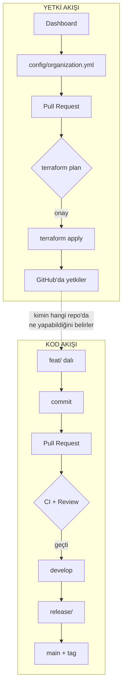
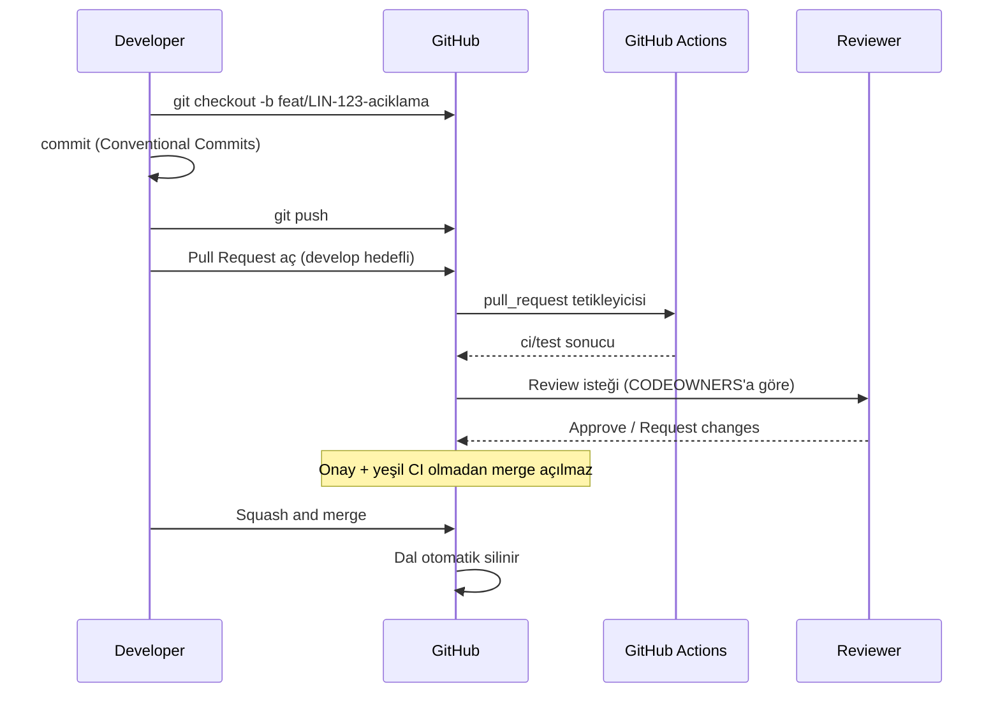
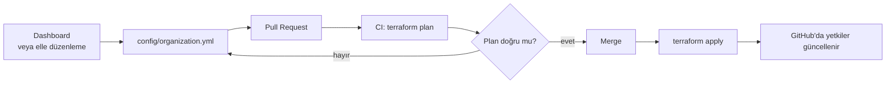

# İş Akışı Rehberi

Bu doküman, Tidyorg mühendislik organizasyonundaki **tüm iş akışlarının giriş
noktasıdır**. Nereden başlayacağını bilmiyorsan buradan başla; her bölüm ilgili detay
dokümanına yönlendirir.

İki ayrı akış vardır ve birbirine karıştırılmamalıdır:

| Akış | Ne değişir | Kim yürütür | Doküman |
| :--- | :--- | :--- | :--- |
| **Kod akışı** | Ürünün kaynak kodu | Developer'lar | Bu doküman, Bölüm 2 |
| **Yetki akışı** | Kimin nereye erişebildiği | Mentör / head-of-engineering | Bu doküman, Bölüm 3 |

---

## 1. Genel Görünüm



İki akışın kesiştiği tek nokta şudur: **yetki akışı, kod akışının kurallarını üretir.**
Bir developer'ın hangi repo'da çalışabildiği, `main`'e kaç onayla merge edilebildiği,
kimin doğrudan push atabildiği — hepsi konfigürasyondan gelir.

---

## 2. Kod Akışı — Günlük Geliştirme Döngüsü

### 2.1 Döngü



### 2.2 Adım adım

**1. Güncel `develop`'tan dal aç**

```bash
git checkout develop
git pull origin develop
git checkout -b feat/LIN-123-user-auth
```

Dal isimlendirme kuralları: [`branching-strategy.md`](branching-strategy.md).
Kısaca: `feat/`, `fix/`, `chore/`, `docs/`, `release/`, `hotfix/`.

> **Kontrol düzlemi repolarında `develop` yoktur.** `tidyorg` gibi
> config ve motor barındıran repolarda dal doğrudan `main`'den açılır ve `main`'e döner.
> Gerekçe: [`branching-strategy.md`](branching-strategy.md) Bölüm 8 (Karar F).

**2. Commit at**

```bash
git commit -m "feat(auth): add google oauth2 login"
```

Format ve örnekler: [`commit-convention.md`](commit-convention.md).
Commit mesajı sürüm numarasını doğrudan etkiler — `feat` minor, `fix` patch,
`!` veya `BREAKING CHANGE` major.

**3. Push et ve PR aç**

```bash
git push -u origin feat/LIN-123-user-auth
```

PR açıldığında şablon otomatik dolar. Boş bırakma: "Why?" bölümü review'ı hızlandıran
en önemli alandır.

**4. CI'ın bitmesini bekle**

`ci/test` yeşile dönmeden merge açılmaz. Kırmızıysa önce onu düzelt; reviewer'ı kırmızı
bir PR ile meşgul etme.

**5. Review al**

Kaç onay gerektiği ve mentör onayının zorunlu olup olmadığı **repo'ya göre değişir**.
Ayrıntı: [`code-review-guide.md`](code-review-guide.md).

**6. Merge et**

`develop`'a merge daima **Squash and Merge** ile yapılır. Dal merge sonrası otomatik
silinir.

### 2.3 Neden doğrudan push atamıyorum?

`main` ve `develop` korumalı dallardır. Developer rolündeki hiç kimse bu dallara
doğrudan yazamaz; katkı yalnızca PR üzerinden gelir. Yalnızca **mentör** ve
**head-of-engineering** rolleri doğrudan yazabilir — acil durumlar için.

Bu kısıt bir güvensizlik işareti değil, iki şeyi garanti eder: her değişiklik
gözden geçirilmiştir ve her değişikliğin bir kaydı vardır.

---

## 3. Yetki Akışı — Erişim Nasıl Değişir

Bu akış developer'ları ilgilendirmez; mentörler ve head-of-engineering yürütür.



**Temel ilke: kod katmanı ile veri katmanı ayrıdır.**

- **Kod (HCL)** — "bir repo nasıl kurulur, kural nasıl uygulanır" tarifi. Nadiren değişir,
  değiştiren platform ekibi.
- **Veri (config)** — "hangi repo var, kimde hangi yetki var". Sık değişir, değiştiren
  mentör.

Dashboard Terraform kodunu **değiştirmez**; yalnızca config dosyasını günceller.

Ayrıntılı alan referansı ve yaygın işlemler: [`config-guide.md`](config-guide.md).

### 3.1 Arayüzden yapılan değişiklikler kalıcı değildir

Bir mentör GitHub arayüzünden branch protection ayarını değiştirirse, bir sonraki
`terraform apply` bunu **geri alır**. Bu bir hata değil, tasarımın parçasıdır: standart
dışına çıkan her değişiklik otomatik olarak standarda döner.

Kalıcı değişikliğin tek yolu konfigürasyondur.

---

## 4. Release Süreci — Özet

`develop`'taki değişiklikler yeterli olgunluğa ulaştığında `main`'e taşınır ve
sürümlenir.

1. `develop`'tan `release/vX.Y.Z` dalı açılır
2. Bu dalda yeni özellik geliştirilmez; yalnızca sürüm hazırlığı yapılır
3. Dal hem `main`'e hem `develop`'a merge edilir
4. `main`'e merge, [`release.yml`](../terraform/templates/.github/workflows/release.yml)
   workflow'unu tetikler: sürüm numarası commit'lerden türetilir, tag atılır,
   changelog'lu bir GitHub Release yayınlanır

> ⚠️ **4. adım bugün çalışmıyor.** `release.yml` hiçbir repo'ya dağıtılmıyor
> (`defaults.workflows: [ci]`); sürüm etiketi şimdilik elle atılmalıdır. Ayrıntı ve
> aktifleştirme adımı: [`release-process.md`](release-process.md) başındaki not.

Tam süreç ve komutlar: [`release-process.md`](release-process.md).

---

## 5. Hotfix Süreci — Özet

Canlı ortamda sistemi durduran kritik bir hata için standart döngü beklenmez.

1. `main`'den `hotfix/aciklama` dalı açılır
2. Düzeltme yapılır, PR ile `main`'e merge edilir
3. **Aynı dal `develop`'a da merge edilmelidir** — aksi halde düzeltme bir sonraki
   sürümde kaybolur

Adım adım komutlar: [`branching-strategy.md`](branching-strategy.md), Bölüm 7.

---

## 6. Bilinmesi Gereken Kısıtlar

### `ci/test` job adı değiştirilemez

Branch protection kuralları `ci/test` adında bir status check bekler. Bu ad
[`ci.yml`](../terraform/templates/.github/workflows/ci.yml) içindeki toplayıcı job'un adıyla
birebir eşleşmek zorundadır.

Job adını değiştirirsen korumalı dallardaki tüm PR'lar hiç raporlanmayacak bir check'i
sonsuza kadar bekler ve **hiçbir şey merge edilemez**. Değiştirmen gerekiyorsa config'de
`require_status_checks` alanını da aynı anda güncelle.

### CI olmayan repo'larda status check zorunluluğu kapatılmalı

Her projede CI olmak zorunda değil. Bir repo'ya CI workflow'u dağıtılmıyorsa
(`workflows` listesinde `ci` yoksa) `require_status_checks` alanı da boşaltılmalıdır;
yoksa yukarıdaki kilit yaşanır.

Bu tutarsızlık sessizce geçmez: modül `plan` aşamasında `precondition` ile hata verir
([`modules/repository/main.tf`](../terraform/modules/repository/main.tf)). Hatayı
gördüğünüzde ya `workflows` listesine `ci` ekleyin ya da `require_status_checks`
içinden `ci/test` değerini çıkarın.

### GitHub plan seviyesi

Şu anda **free plan + public repo** ile çalışılıyor. Private repo'larda branch protection,
ruleset ve push kısıtları GitHub Team planı gerektirir. Bu bilinçli ve geçici bir
durumdur; ayrıntı [`ACCESS-MODEL.md`](../ACCESS-MODEL.md).

---

## 7. Doküman Haritası

### Günlük iş için
| Doküman | Ne zaman okunur |
| :--- | :--- |
| [`onboarding.md`](onboarding.md) | Ekibe yeni katıldığında |
| [`branching-strategy.md`](branching-strategy.md) | Dal açarken, hotfix gerektiğinde |
| [`commit-convention.md`](commit-convention.md) | Commit mesajı yazarken |
| [`code-review-guide.md`](code-review-guide.md) | PR açarken ve review yaparken |
| [`release-process.md`](release-process.md) | Sürüm çıkarırken |

### Yetki ve yönetim için
| Doküman | Ne zaman okunur |
| :--- | :--- |
| [`config-guide.md`](config-guide.md) | Yetki/repo değişikliği yaparken |
| [`rbac-and-permissions.md`](rbac-and-permissions.md) | Roller ve yetki matrisi için |
| [`../ACCESS-MODEL.md`](../ACCESS-MODEL.md) | Modelin gerekçesini anlamak için |
| [`runbook.md`](runbook.md) | Operasyonel bir senaryoda (offboarding, repo kapatma) |
| [`security-policy.md`](security-policy.md) | Sır yönetimi ve güvenlik kuralları |

### Kararların kaydı
| Doküman | İçerik |
| :--- | :--- |
| [`adr/`](adr/) | Mimari kararlar ve gerekçeleri |
