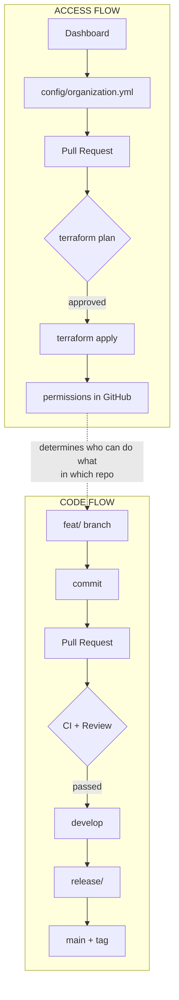
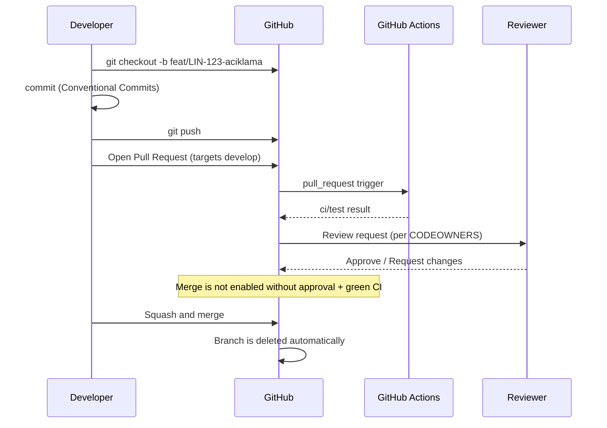
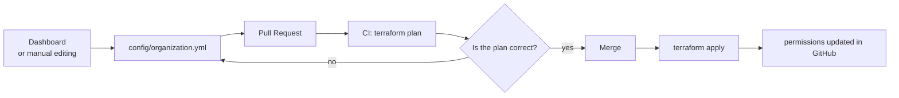

# Workflow Guide

This document is the **entry point for all workflows** in the Tidyorg engineering
organization. If you don't know where to start, start here; each section points you to the
relevant detailed document.

There are two separate flows and they must not be confused:

| Flow | What changes | Who runs it | Document |
| :--- | :--- | :--- | :--- |
| **Code flow** | The product's source code | Developers | This document, Section 2 |
| **Access flow** | Who can access what | Mentor / head-of-engineering | This document, Section 3 |

---

## 1. Overview



The only point where the two flows intersect is this: **the access flow produces the rules of the
code flow.** Which repo a developer can work in, with how many approvals something can be merged to
`main`, who can push directly — all of it comes from the configuration.

---

## 2. Code Flow — The Daily Development Cycle

### 2.1 The cycle



### 2.2 Step by step

**1. Open a branch from an up-to-date `develop`**

```bash
git checkout develop
git pull origin develop
git checkout -b feat/LIN-123-user-auth
```

Branch naming rules: [`branching-strategy.md`](branching-strategy.md).
In short: `feat/`, `fix/`, `chore/`, `docs/`, `release/`, `hotfix/`.

> **Control-plane repos have no `develop`.** In repos that host config and the engine, like `tidyorg`,
> branches are opened directly from `main` and return to `main`.
> Rationale: [`branching-strategy.md`](branching-strategy.md) Section 8 (Decision F).

**2. Commit**

```bash
git commit -m "feat(auth): add google oauth2 login"
```

Format and examples: [`commit-convention.md`](commit-convention.md).
The commit message directly affects the version number — `feat` minor, `fix` patch,
`!` or `BREAKING CHANGE` major.

**3. Push and open a PR**

```bash
git push -u origin feat/LIN-123-user-auth
```

When the PR is opened, the template fills in automatically. Don't leave it blank: the "Why?"
section is the most important field for speeding up review.

**4. Wait for CI to finish**

Merge is not enabled until `ci/test` turns green. If it is red, fix that first; don't keep the
reviewer busy with a red PR.

**5. Get a review**

How many approvals are required and whether mentor approval is mandatory **varies by repo**.
Details: [`code-review-guide.md`](code-review-guide.md).

**6. Merge**

Merging to `develop` is always done with **Squash and Merge**. The branch is deleted automatically
after the merge.

### 2.3 Why can't I push directly?

`main` and `develop` are protected branches. Nobody in the developer role can write to these
branches directly; contributions come only via PRs. Only the **mentor** and
**head-of-engineering** roles can write directly — for emergencies.

This restriction is not a sign of distrust; it guarantees two things: every change has been
reviewed, and every change has a record.

---

## 3. Access Flow — How Access Changes

This flow does not concern developers; mentors and head-of-engineering run it.



**Core principle: the code layer and the data layer are separate.**

- **Code (HCL)** — the recipe for "how a repo is set up, how a rule is applied". It rarely changes,
  and it is the platform team that changes it.
- **Data (config)** — "which repo exists, who has which permission". It changes often, and it is the
  mentor who changes it.

The Dashboard does **not** change the Terraform code; it only updates the config file.

Detailed field reference and common operations: [`config-guide.md`](config-guide.md).

### 3.1 Changes made from the interface are not permanent

If a mentor changes a branch protection setting from the GitHub interface, the next
`terraform apply` **undoes** it. This is not a bug, it is part of the design: every change that
strays from the standard automatically returns to the standard.

The only way to make a permanent change is through the configuration.

---

## 4. Release Process — Summary

When the changes in `develop` reach sufficient maturity, they are moved to `main` and
versioned.

1. A `release/vX.Y.Z` branch is opened from `develop`
2. No new features are developed on this branch; only release preparation is done
3. The branch is merged into both `main` and `develop`
4. Merging to `main` triggers the [`release.yml`](../terraform/templates/.github/workflows/release.yml)
   workflow: the version number is derived from commits, a tag is created, and a GitHub Release
   with a changelog is published

> ⚠️ **Step 4 does not work today.** `release.yml` is not deployed to any repo
> (`defaults.workflows: [ci]`); for now the version tag must be created by hand. Details and the
> activation step: the note at the top of [`release-process.md`](release-process.md).

Full process and commands: [`release-process.md`](release-process.md).

---

## 5. Hotfix Process — Summary

For a critical bug that halts the system in production, you don't wait for the standard cycle.

1. A `hotfix/aciklama` branch is opened from `main`
2. The fix is made and merged into `main` via a PR
3. **The same branch must also be merged into `develop`** — otherwise the fix is lost in the next
   version

Step-by-step commands: [`branching-strategy.md`](branching-strategy.md), Section 7.

---

## 6. Constraints You Need to Know

### The `ci/test` job name cannot be changed

Branch protection rules expect a status check named `ci/test`. This name must match, exactly, the
name of the aggregator job in [`ci.yml`](../terraform/templates/.github/workflows/ci.yml).

If you change the job name, all PRs on protected branches will wait forever for a check that will
never be reported, and **nothing can be merged**. If you need to change it, update the
`require_status_checks` field in the config at the same time.

### In repos without CI, the status check requirement must be turned off

Not every project has to have CI. If a repo is not getting a CI workflow deployed
(if `ci` is not in the `workflows` list), the `require_status_checks` field must also be emptied;
otherwise the lockup above occurs.

This inconsistency does not pass silently: at the `plan` stage the module errors via a
`precondition` ([`modules/repository/main.tf`](../terraform/modules/repository/main.tf)). When you
see the error, either add `ci` to the `workflows` list or remove the `ci/test` value from
`require_status_checks`.

### GitHub plan level

We are currently working with a **free plan + public repo**. On private repos, branch protection,
rulesets, and push restrictions require the GitHub Team plan. This is a deliberate and temporary
situation; details in [`ACCESS-MODEL.md`](../ACCESS-MODEL.md).

---

## 7. Document Map

### For daily work
| Document | When to read it |
| :--- | :--- |
| [`onboarding.md`](onboarding.md) | When you newly join the team |
| [`branching-strategy.md`](branching-strategy.md) | When opening a branch, when a hotfix is needed |
| [`commit-convention.md`](commit-convention.md) | When writing a commit message |
| [`code-review-guide.md`](code-review-guide.md) | When opening a PR and doing a review |
| [`release-process.md`](release-process.md) | When releasing a version |

### For access and management
| Document | When to read it |
| :--- | :--- |
| [`config-guide.md`](config-guide.md) | When making an access/repo change |
| [`rbac-and-permissions.md`](rbac-and-permissions.md) | For roles and the permission matrix |
| [`../ACCESS-MODEL.md`](../ACCESS-MODEL.md) | To understand the rationale of the model |
| [`runbook.md`](runbook.md) | In an operational scenario (offboarding, closing a repo) |
| [`security-policy.md`](security-policy.md) | Secret management and security rules |

### The record of decisions
| Document | Content |
| :--- | :--- |
| [`adr/`](adr/) | Architectural decisions and their rationale |
